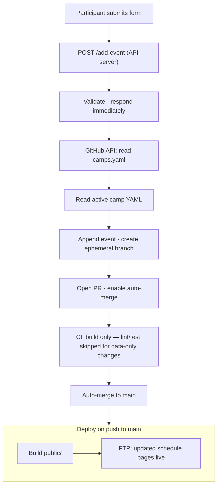

# SB Sommar – Architecture Overview

This project is a static, YAML-driven camp platform with a small Node.js API server for live event submissions.

The system is intentionally simple:

- No database
- No CMS
- No server-side rendering — HTML is generated at build time
- Git is the archive

---

## 1. Data Layer

Each camp has exactly one YAML file in `source/data/`:

```text
source/data/2025-06-syssleback.yaml
source/data/2025-08-syssleback.yaml
source/data/2026-06-syssleback.yaml
```

Each file contains:

- Camp metadata (name, dates, location)
- A list of events

Events are unique on the combination of `(title + date + start)`.

This is the single source of truth for all camp content.

---

## 2. Metadata Layer

`source/data/camps.yaml` is the central registry of all camps, past and present.

It contains:

- All camps (active, archived, and upcoming)
- Their date ranges
- Which file contains their events
- Which camp is currently active

Example entry:

```yaml
camps:
  - id: 2026-06-syssleback
    name: SB Sommar Juni 2026
    start_date: 2026-06-28
    end_date: 2026-07-05
    file: 2026-06-syssleback.yaml
    archived: false
    active: true
```

The site never hardcodes file names. It always reads from `camps.yaml` first.

Only one camp should have `active: true` at a time.

---

## 3. Active Camp and Event Submissions

During camp week, participants submit activities through the `/lagg-till.html` form.

The API server (`app.js`) handles each submission as follows:

1. Validates the incoming event data.
2. Responds immediately with a success confirmation — the form does not wait for the rest of the process.
3. Reads `source/data/camps.yaml` from GitHub via the Contents API.
4. Finds the active camp and reads its YAML file from GitHub.
5. Appends the new event and commits it to a temporary branch.
6. Opens a pull request with auto-merge enabled.
7. CI runs a build-only check (lint and tests are skipped for data-only changes — commits that only modify YAML files in `source/data/`).
8. The PR merges automatically. The deploy pipeline runs and the schedule is live within minutes.

The active camp's YAML file is always version-controlled. Git history provides a full audit trail of every event submitted through the form.



---

## 4. Archive Layer

After camp ends:

1. Set `active: false` for the camp in `source/data/camps.yaml`.
2. Set `archived: true`.
3. Commit the final YAML file — it becomes the permanent archive.
4. Deploy. The site now shows the next active camp, or the most recent archived camp if none is active.

No data is ever lost.

---

## 5. Rendering Logic

At build time:

1. Load `source/data/camps.yaml`.
2. Find the camp where `active: true`.
3. Load its YAML file.
4. Sort events chronologically.
5. Render HTML pages.

Fallback: if no camp is `active: true`, the camp with the most recent `start_date` is shown.

---

## 6. Project Structure

```text
source/data/      YAML source files (camps registry, per-camp events, locations)
source/content/   Markdown page sections
source/build/     Build scripts → generates public/
source/api/       API handlers (github.js, validate.js)
public/           Generated output — do not edit directly
app.js            Express server entry point
```

Key files:

| File | Role |
| ---- | ---- |
| `source/data/camps.yaml` | Registry of all camps; determines which is active |
| `source/data/local.yaml` | Predefined location list — the only place locations are defined |
| `source/data/YYYY-MM-name.yaml` | Per-camp event files, referenced from `camps.yaml` |
| `app.js` | Express (Node.js web server) — serves `public/` and handles `POST /add-event` |

---

## 7. Design Philosophy

- YAML is the database
- Git is the archive
- Simplicity over cleverness
- One clear data contract
- No hidden state

The system must remain:

- Predictable
- Minimal
- Maintainable
