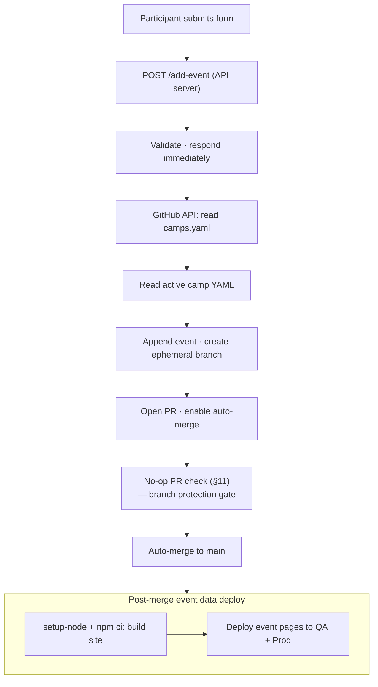
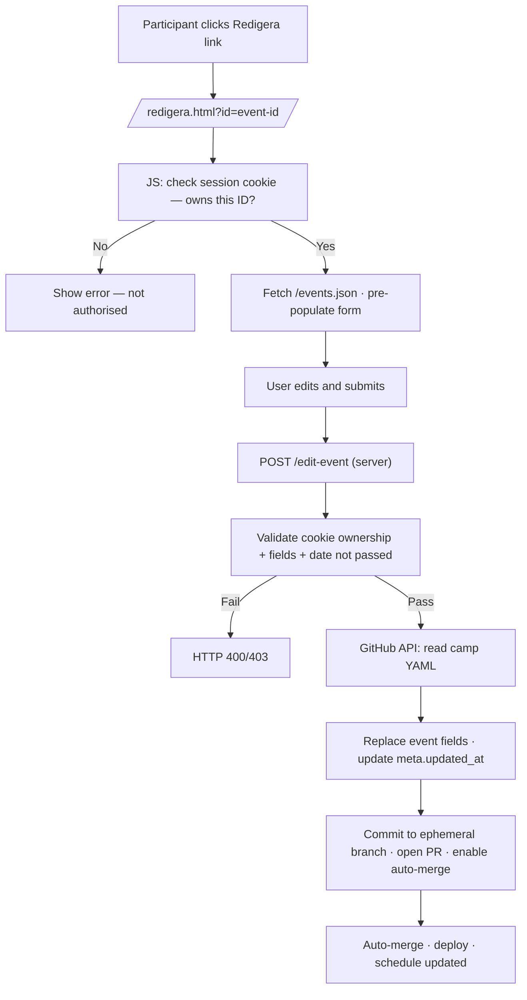

# SB Sommar – Architecture Overview

This project is a static, YAML-driven camp platform with a small API server for live event submissions. Two API implementations exist: a Node.js version (`app.js`) for local development and Node.js-capable hosts, and a PHP version (`api/`) for shared hosting environments (e.g. Loopia) that do not support Node.js.

The system is intentionally simple:

- No database
- No CMS
- No server-side rendering — HTML is generated at build time
- Git is the archive

---

## 1. Data Layer

Each camp has exactly one YAML file in `source/data/`:

```text
source/data/2025-06-syssleback.yaml
source/data/2025-08-syssleback.yaml
source/data/2026-06-syssleback.yaml
```

Each file contains:

- Camp metadata (name, dates, location)
- A list of events

Events are unique on the combination of `(title + date + start)`.

This is the single source of truth for all camp content.

---

## 2. Metadata Layer

`source/data/camps.yaml` is the central registry of all camps, past and present.

It contains:

- All camps (active, archived, and upcoming)
- Their date ranges
- Which file contains their events
- Which camp is currently active

Example entry:

```yaml
camps:
  - id: 2026-06-syssleback
    name: SB Sommar Juni 2026
    start_date: 2026-06-28
    end_date: 2026-07-05
    file: 2026-06-syssleback.yaml
    archived: false
```

The site never hardcodes file names. It always reads from `camps.yaml` first.

The active camp is **derived at build time and API request time** — there is
no manual `active` flag. The derivation rules (in priority order):

1. **On dates** — today falls within `start_date..end_date` (inclusive).
2. **Next upcoming** — nearest future `start_date`.
3. **Most recent** — latest `end_date`, even if archived.

If two camps overlap, the one with the earlier `start_date` wins.

The derivation logic lives in `source/scripts/resolve-active-camp.js` and is
shared by `build.js` and the API (`github.js`).

### QA camp isolation

Camps may have an optional `qa: true` field. QA camps are filtered based on
the `BUILD_ENV` environment variable:

- **Production** (`BUILD_ENV=production`): QA camps are excluded from
  the camps array at the top of `build.js`, before the array is passed
  to `resolveActiveCamp()` or any rendering function. This ensures QA
  camps never appear in production output (schedule, index camp list,
  archive, RSS, calendar, or API responses).
- **QA** (`BUILD_ENV=qa`): QA camps that are on dates take priority over
  non-QA camps, ensuring the QA camp is always active in QA.
- **Local** (`BUILD_ENV` unset): No filtering — all camps are included
  and normal derivation rules apply.

The QA camp (`qa-testcamp`) uses a full-year date range so that events
submitted on any day pass date validation. See `02-REQUIREMENTS.md §42`.

---

## 3. Active Camp and Event Submissions

During camp week, participants submit activities through the `/lagg-till.html` form.

The API server (`app.js`) handles each submission as follows:

1. Validates the incoming event data, including security scanning for injection patterns and link protocol validation (see §11.8).
2. Responds immediately with a success confirmation — the form does not wait for the rest of the process.
3. Reads `source/data/camps.yaml` from GitHub via the Contents API.
4. Derives the active camp from dates and reads its YAML file from GitHub.
5. Appends the new event and commits it to a temporary branch. The serialised YAML block is indented to match the existing `events:` list so the file remains valid YAML.
6. Opens a pull request with auto-merge enabled.
7. The event data PR check (see §11) runs — a no-op that satisfies branch protection.
8. The PR merges automatically via auto-merge.
9. The post-merge event data deploy workflow (see §11) installs production dependencies via `setup-node` + `npm ci --omit=dev`, builds the site, and uploads event-data pages to QA and Production.

The updated schedule is visible to participants within minutes of submission.

The active camp's YAML file is always version-controlled. Git history provides a full audit trail of every event submitted through the form.



---

## 4. Archive Layer

After camp ends:

1. Set `archived: true` for the camp in `source/data/camps.yaml`.
2. Commit the change — the YAML file becomes the permanent archive.
3. Deploy. The system automatically derives the next active camp from dates.

No data is ever lost.

---

## 4a. Archive Page Rendering

At build time, `source/build/render-arkiv.js` produces `public/arkiv.html`.

Data sources:

- `camps.yaml` — camp metadata (name, dates, location, information, link).
- Per-camp event YAML files (referenced via the `file:` field in `camps.yaml`) —
  event data for the event list inside each accordion panel.

Steps:

1. Filter `camps` to those with `archived: true`.
2. Sort descending by `start_date` (newest first).
3. For each archived camp, load its event YAML file (via the `file:` field in
   `camps.yaml`) and pass the events array to the template.
4. Render a vertical timeline: each camp is one `<li>` in an `<ol class="timeline">`.
5. Each timeline item contains:
   - A `<button>` accordion header showing the camp name, with date range and
     location in subdued text to the right.
   - A hidden `<div>` panel with:
     - Facebook logo link (if `link` is non-empty), using the image at
       `images/social-facebook-button-blue-icon-small.webp`.
     - Camp metadata (dates, location).
     - Information paragraph (if non-empty).
     - Event list grouped by day, using the same row format as the schedule page.
6. The panel is hidden/shown by toggling `aria-expanded` and `hidden` via
   `source/assets/js/client/arkiv.js` — no framework.
7. Only one panel may be open at a time; the JS closes any previously open panel
   before opening the new one.
8. The JS toggles a CSS class on the active timeline dot to highlight the
   selected camp on the timeline.

### Fields used from `camps.yaml`

| Field | Used for |
| --- | --- |
| `name` | Accordion header (primary text) |
| `start_date` | Date range display; sort key; header metadata |
| `end_date` | Date range display; header metadata |
| `location` | Header metadata (gray text); location line in panel |
| `information` | Information paragraph (omitted if empty) |
| `link` | Facebook logo link (omitted if empty) |
| `file` | Path to per-camp event YAML for event list |

Dates are formatted in Swedish: `D månadsnamn YYYY` (e.g. "22 juni 2025").

### Archive page files

| File | Role |
| --- | --- |
| `source/build/render-arkiv.js` | Renders `public/arkiv.html` at build time |
| `source/assets/js/client/arkiv.js` | Accordion open/close + ARIA state on the archive page |

### Archive page changes to existing files

| File | Change |
| --- | --- |
| `source/build/build.js` | Call `renderArkivPage(camps)` and write `public/arkiv.html` |
| `source/build/layout.js` | Add "Arkiv" nav link |

---

## 4b. Shared Site Footer

Every page produced by the build includes a `<footer class="site-footer">` element
at the bottom of `<body>`.

### Content source

Footer content lives in `source/content/footer.md`. Non-technical contributors
can edit this file to change the footer on all pages without touching any template
or render function.

### Build-time rendering

`source/build/build.js`:

1. Reads `source/content/footer.md` at the start of the build, before rendering
   any page.
2. Converts the Markdown to HTML using `convertMarkdown()` from
   `source/build/render-index.js` (powered by the `marked` library; the same
   pipeline used for homepage sections).
3. If the file does not exist, `footerHtml` is set to an empty string — no error,
   no crash.
4. Passes `footerHtml` as an argument to every render function.

### Render functions

Each render function (`renderSchedulePage`, `renderTodayPage`, `renderIdagPage`,
`renderAddPage`, `renderEditPage`, `renderArkivPage`, `renderIndexPage`) accepts
`footerHtml` as its last argument. It calls `pageFooter(footerHtml)` from
`source/build/layout.js` and places the result immediately before `</body>`.

`pageFooter(footerHtml)`:

- Returns `<footer class="site-footer">…</footer>` when `footerHtml` is non-empty.
- Returns an empty string when `footerHtml` is empty (file-missing fallback).

### No duplication

No render function contains literal footer text. The Markdown file is the single
source of truth. Updating `footer.md` and rebuilding changes the footer on every
page simultaneously.

### Files changed

| File | Change |
| --- | --- |
| `source/content/footer.md` | New file — footer content in Markdown |
| `source/build/layout.js` | Add `pageFooter(footerHtml)` |
| `source/build/build.js` | Load `footer.md`, convert to HTML, pass to all render calls |
| `source/build/render.js` | Accept `footerHtml`; inject via `pageFooter()` |
| `source/build/render-today.js` | Accept `footerHtml`; inject via `pageFooter()` |
| `source/build/render-idag.js` | Accept `footerHtml`; inject via `pageFooter()` |
| `source/build/render-add.js` | Accept `footerHtml`; inject via `pageFooter()` |
| `source/build/render-edit.js` | Accept `footerHtml`; inject via `pageFooter()` |
| `source/build/render-arkiv.js` | Accept `footerHtml`; inject via `pageFooter()` |
| `source/build/render-index.js` | Accept `footerHtml`; inject via `pageFooter()` |
| `source/assets/cs/style.css` | Add `.site-footer` styles |

---

## 4c. Search Engine and Crawler Blocking

The site is intentionally hidden from search engines. Two mechanisms enforce this:

### robots.txt

`source/build/build.js` writes `public/robots.txt` during the build:

```text
User-agent: *
Disallow: /
```

This tells well-behaved crawlers not to index any page.

### Meta robots tag

Every HTML page includes a `<meta name="robots" content="noindex, nofollow">` tag
in its `<head>` section. This is the browser-level signal that reinforces
`robots.txt` for crawlers that follow the meta tag standard.

Each render function (`renderSchedulePage`, `renderTodayPage`, `renderIdagPage`,
`renderAddPage`, `renderEditPage`, `renderArkivPage`, `renderIndexPage`) emits
the tag as part of its `<head>` block.

### Crawler-blocking files changed

| File | Change |
| --- | --- |
| `source/build/build.js` | Write `public/robots.txt` during build |
| `source/build/render.js` | Add `<meta name="robots">` to `<head>` |
| `source/build/render-today.js` | Add `<meta name="robots">` to `<head>` |
| `source/build/render-idag.js` | Add `<meta name="robots">` to `<head>` |
| `source/build/render-add.js` | Add `<meta name="robots">` to `<head>` |
| `source/build/render-edit.js` | Add `<meta name="robots">` to `<head>` |
| `source/build/render-arkiv.js` | Add `<meta name="robots">` to `<head>` |
| `source/build/render-index.js` | Add `<meta name="robots">` to `<head>` |

---

## 5. Rendering Logic

At build time:

1. Load `source/data/camps.yaml`.
2. Derive the active camp from dates (see §2 for derivation rules).
3. Load its YAML file.
4. Sort events chronologically.
5. Render HTML pages.

---

## 6. Project Structure

```text
source/data/      YAML source files (camps registry, per-camp events, locations)
source/content/   Markdown page sections
source/build/     Build scripts → generates public/
source/api/       Node.js API handlers (github.js, validate.js)
api/              PHP API (alternative backend for shared hosting)
public/           Generated output — do not edit directly
app.js            Express server entry point (Node.js)
```

Key files:

| File | Role |
| ---- | ---- |
| `source/data/camps.yaml` | Registry of all camps; determines which is active |
| `source/data/local.yaml` | Predefined location list — the only place locations are defined |
| `source/data/YYYY-MM-name.yaml` | Per-camp event files, referenced from `camps.yaml` |
| `app.js` | Express (Node.js web server) — serves `public/`, handles `POST /add-event` and `POST /edit-event` |
| `api/index.php` | PHP API entry point — handles `POST /api/add-event` and `POST /api/edit-event` |
| `public/events.json` | Generated at build time; all public event fields for the active camp |

---

## 7. Participant Event Editing — Session Cookie Architecture

### Overview

Participants who submit an event gain temporary ownership of that event,
tracked through a browser cookie. They can then edit the event until its
date passes. No server-side session store is used.

### Cookie design

| Property | Value |
| --- | --- |
| Name | `sb_session` |
| Content | JSON array of event ID strings |
| Max-Age | 7 days (604 800 s) |
| Secure | Yes (HTTPS only) |
| SameSite | Strict |
| HttpOnly | **No** — see note below |

**Why the cookie is not `httpOnly`:**
The schedule pages are static HTML, pre-rendered at build time. There is no
server-side rendering at request time. Client-side JavaScript is therefore the
only layer that can read the cookie and selectively show edit links for events
the current visitor owns. Making the cookie `httpOnly` would prevent this.
Security is maintained through server-side validation: the `/edit-event` endpoint
always verifies that the target event ID appears in the cookie sent with the
request. An attacker who cannot forge a session cookie they do not have cannot
edit events they do not own.

### Cookie lifecycle

1. User submits the add-activity form and accepts cookie consent.
2. Server validates the event, responds with `Set-Cookie: sb_session=…`.
3. The cookie contains the new event's ID merged with any IDs already in
   the existing cookie.
4. On every page load, `source/assets/js/client/session.js` reads the
   cookie, removes IDs for events whose dates have passed, and writes the
   cleaned cookie back (or deletes it if the array becomes empty).
5. Schedule pages read the cookie and attach "Redigera" links to matching
   event rows.

### /events.json

At build time, `source/build/build.js` writes `public/events.json` — a JSON
array of all public event fields for the active camp. The edit page
(`/redigera.html`) fetches this file client-side to pre-populate the edit
form with current event data.

### Edit endpoint

`POST /edit-event` handles edit submissions:

1. Read and parse the `sb_session` cookie from the request.
2. Confirm the target event ID is in the cookie array.
3. Validate the submitted fields (same rules as `POST /add-event`).
4. Confirm the event's date has not passed.
5. Read the camp YAML from GitHub, locate the event by ID, replace mutable
   fields, update `meta.updated_at`.
6. Commit to an ephemeral branch and open a PR with auto-merge — same
   pipeline as event additions.



### Cookie consent

Before the session cookie is set, the add-activity page prompts the user for
cookie consent (first submission only, per browser). The consent decision is
stored in `localStorage` under the key `sb_cookie_consent`. If the user
declines, the event is still submitted but no session cookie is set.

### New files

| File | Role |
| --- | --- |
| `source/assets/js/client/session.js` | Reads/cleans session cookie; injects edit links on schedule pages |
| `source/assets/js/client/cookie-consent.js` | Displays consent prompt; writes `localStorage` decision |
| `source/assets/js/client/redigera.js` | Edit form logic: load event data, validate, submit |
| `source/build/render-edit.js` | Renders static `/redigera.html` at build time |
| `source/api/edit-event.js` | Server-side edit handler: ownership check, YAML patch, GitHub PR |

### Modified files

| File | Change |
| --- | --- |
| `app.js` | Add `POST /edit-event` route; add cookie-parser middleware |
| `source/build/build.js` | Build `/redigera.html`; write `public/events.json` |
| `source/build/render.js` | Add `data-event-id` attribute to event rows |
| `source/api/github.js` | Add `updateEventInActiveCamp()` function |

---

## 7a. Per-Field Inline Validation Errors

Both the add-activity and edit-activity forms validate required fields
on submit. Each validation error is displayed inline, directly below the
input it relates to — not in a single aggregated error box.

### HTML structure

Each `.field` div contains an error `<span>` after its input element:

```html
<span class="field-error" id="err-title" hidden></span>
```

The input links to its error span via `aria-describedby="err-title"`.

### Validation flow (client-side)

1. On submit, JS iterates over each required field.
2. For each invalid field: set `aria-invalid="true"` on the input,
   populate and show its `.field-error` span.
3. For each valid field: remove `aria-invalid`, hide the error span.
4. If any field is invalid, focus the first invalid input and cancel submit.
5. If all fields are valid, proceed to the submit flow (§8/§9).

### Clearing errors

Errors are cleared on the next submit attempt — not on individual
keystroke or blur. This keeps the JS simple and avoids distracting
the user while they are still filling in the form.

### Accessibility

- `aria-invalid="true"` communicates the error state to screen readers.
- `aria-describedby` links each input to its error message so the
  error is announced when the input receives focus.

### Inline validation files changed

| File | Change |
| --- | --- |
| `source/build/render-add.js` | Add `.field-error` spans and `aria-describedby` to inputs; remove `#form-errors` div |
| `source/build/render-edit.js` | Same changes as render-add.js |
| `source/assets/js/client/lagg-till.js` | Rewrite validation to show per-field errors |
| `source/assets/js/client/redigera.js` | Same validation rewrite |
| `source/assets/cs/style.css` | Add `.field-error` and `[aria-invalid="true"]` styles; remove `.form-errors` styles |

---

## 8. Add-Activity Submit Flow — Field Locking and Progress Modal

### Submit flow stages

When the user presses "Skicka" and validation passes, the submit flow
proceeds through four stages before returning control to the user:

1. **Field lock** — all form inputs and the submit button are disabled
   immediately, preventing edits or re-submission during the async flow.
2. **Consent prompt** (if needed) — `cookie-consent.js` renders the consent
   prompt inside the existing `#submit-modal` as a modal dialog with backdrop
   and focus trap. The user accepts or declines. The modal content then
   transitions to the progress state (stage 3) without closing.
3. **Progress modal** — a modal dialog opens over the page with a spinner and
   the text "Skickar till GitHub…". The fetch begins.
4. **Result** — the modal content is replaced with a success or error state
   depending on the server response.

### Field locking

All `<input>`, `<select>`, and `<textarea>` elements inside `#event-form`
are disabled by wrapping the form body in a `<fieldset>` and setting
`fieldset.disabled = true`. This is simpler and more reliable than disabling
each element individually. CSS uses `opacity` and `cursor: not-allowed` on
`fieldset:disabled` to communicate the locked state visually.

### Progress modal

The modal is a `<div>` injected into `<body>` by `lagg-till.js` on first
submit. It is re-used on subsequent submissions ("Lägg till en till").

Structure:

```html
<div id="submit-modal" role="dialog" aria-modal="true" aria-labelledby="modal-heading" hidden>
  <div class="modal-backdrop"></div>
  <div class="modal-box">
    <h2 id="modal-heading"><!-- heading text set by JS --></h2>
    <!-- spinner / message / actions set by JS -->
  </div>
</div>
```

The backdrop covers the full viewport (fixed, full-width/height) and blocks
scroll via `overflow: hidden` on `<body>` while open. The modal box is
centered with flexbox.

Focus is trapped: when the modal opens, focus moves to the first focusable
element inside `.modal-box`. Tab and Shift+Tab wrap within the modal.

### States

| State | Heading | Content |
| --- | --- | --- |
| Loading | "Skickar…" | Spinner + "Skickar till GitHub…" |
| Success | "Aktiviteten är tillagd!" | Title, "Den syns i schemat om ungefär en minut.", optional no-edit note, two action buttons |
| Error | "Något gick fel" | Error message + "Försök igen" button |

### "Försök igen" and "Lägg till en till"

- **Försök igen**: closes the modal, sets `fieldset.disabled = false`,
  restores focus to the submit button. Form data is preserved so the user
  can correct the issue.
- **Lägg till en till**: closes the modal, calls `form.reset()`, sets
  `fieldset.disabled = false`, scrolls to top.

### Files affected

| File | Change |
| --- | --- |
| `source/build/render-add.js` | Wrap form fields in `<fieldset>`, remove `#result` section, add `#submit-modal` skeleton |
| `source/assets/js/client/lagg-till.js` | Implement lock/modal/state logic |
| `source/assets/cs/style.css` | Add `fieldset:disabled` style, modal backdrop, modal box |

---

## 9. Edit-Activity Submit Flow — Progress Modal

The edit-activity submit flow mirrors the add-activity flow (§8) but without a
consent step, and with success text appropriate for an update rather than a new
submission.

### Edit submit flow stages

When the user presses "Spara ändringar" and validation passes:

1. **Field lock** — all form inputs and the submit button are disabled
   immediately via `fieldset.disabled = true`.
2. **Progress modal** — a modal dialog opens over the page with a spinner and
   the text "Sparar till GitHub…". The fetch begins.
3. **Result** — the modal content is replaced with a success or error state
   depending on the server response.

### Edit form field locking

The edit form wraps all its fields in a `<fieldset>` (same pattern as the add
form). Setting `fieldset.disabled = true` disables all child inputs and the
submit button atomically. CSS communicates the locked state visually via
`opacity` and `cursor: not-allowed` on `fieldset:disabled`.

### Edit progress modal

The modal uses the same `#submit-modal` HTML skeleton and CSS as the add form —
`role="dialog"`, `aria-modal="true"`, `aria-labelledby="modal-heading"`, focus
trapping, and `body.modal-open { overflow: hidden }`.

### Edit modal states

| State | Heading | Content |
| --- | --- | --- |
| Loading | "Sparar…" | Spinner + "Sparar till GitHub…" |
| Success | "Aktiviteten är uppdaterad!" | Title, "Den syns i schemat om ungefär en minut.", "Gå till schemat →" link |
| Error | "Något gick fel" | Error message + "Försök igen" button |

### Edit "Försök igen"

Closes the modal, sets `fieldset.disabled = false`, restores focus to the submit
button. Form data is preserved so the user can correct and resubmit.

### Edit files affected

| File | Change |
| --- | --- |
| `source/build/render-edit.js` | Wrap form fields in `<fieldset>`, remove `#result` section, add `#submit-modal` skeleton |
| `source/assets/js/client/redigera.js` | Implement lock/modal/state logic |

---

## 11. Event Data CI Pipeline

When a participant submits or edits an activity, `source/api/github.js` opens an ephemeral
PR from a branch named `event/**` (add) or `event-edit/**` (edit). The pipeline has two
phases:

1. **PR check** (`.github/workflows/event-data-deploy.yml`) — a no-op job that satisfies
   branch protection so auto-merge can proceed.
2. **Post-merge deploy** (`.github/workflows/event-data-deploy-post-merge.yml`) — installs
   production dependencies via `setup-node` + `npm ci --omit=dev`, builds the site, and
   deploys event-data pages to all environments via SCP.

All event data validation (injection patterns, link protocol, length limits, structural
checks) runs in the API layer at submission time (see §11.6). Data that reaches git is
already validated.

### 11.1 Dependency installation

Each deploy job uses `actions/setup-node@v4` with `node-version: '20'` and `cache: 'npm'`
to install Node.js and restore the npm cache. Production dependencies (`js-yaml`, `marked`,
`qrcode`) are installed via `npm ci --omit=dev`.

For the QA job, setup-node and npm ci are conditional on the gate step —
skipped when no event data file changed. For the production job they run unconditionally
because the gate step itself uses `node -e` with `js-yaml` to check QA camp status.

> **Note:** §11.1 previously described a Docker build image (`ghcr.io/<owner>/<repo>`).
> That approach was replaced by setup-node + npm cache (see 02-REQUIREMENTS.md §52).

### 11.2 PR check (event-data-deploy.yml)

A single job that:

- Triggers on PRs to `main` with path `source/data/**.yaml`, filtered to branches
  matching `event/` or `event-edit/` prefixes.
- Logs "Validated at API layer" and exits successfully.

This job exists solely to satisfy branch protection. No validation, build, or deploy
runs during the PR phase.

### 11.3 Post-merge deploy (event-data-deploy-post-merge.yml)

Triggers on push to `main` with path filter `source/data/**.yaml`. Uses
`actions/setup-node@v4` with npm cache and `npm ci --omit=dev` for dependency installation.

Two deploy jobs start immediately in parallel — there is no separate detect job.
Each job performs its own inline detection as a first step:

- **deploy-qa** — detects changed file inline, builds with QA environment secrets,
  uploads via rsync.
- **deploy-prod** — detects changed file inline and checks QA camp status; skips
  build and deploy when the file belongs to a QA camp. Otherwise builds with
  production environment secrets and uploads via SCP.

Each deploy job:

1. Checks out the repository with `fetch-depth: 2`.
2. Detects the changed per-camp YAML file by comparing `HEAD~1..HEAD`.
   If no event data file changed, the remaining steps are skipped.
3. (Production only) Determines whether the changed file belongs to a QA
   camp. If so, the remaining steps are skipped.
4. Runs `node source/build/build.js`.
5. Stages only event-data-derived files: `schema.html`, `idag.html`,
   `dagens-schema.html`, `events.json`, `schema.rss`, `schema.ics`,
   `kalender.html`, and per-event pages under `schema/`.
6. Uploads the staged files via SCP to the target environment.

### 11.4 CI workflow for data-only changes

`ci.yml` detects data-only changes (`has_code == false`) and skips `npm ci` and
`npm run build` entirely. The job passes after the detect step. Building event-data
changes is the responsibility of the post-merge deploy workflow.

### 11.5 Relationship to existing workflows

| Workflow | Trigger | Scope |
| --- | --- | --- |
| `ci.yml` | All branches + PRs | Lint, test, build for code changes; pass-through for data-only |
| `event-data-deploy.yml` | PRs from `event/**`, `event-edit/**` | No-op branch protection gate |
| `event-data-deploy-post-merge.yml` | Push to `main` (data YAMLs only) | setup-node + npm ci + build + deploy to QA, Production |
| `deploy-qa.yml` | Push to `main` (ignores data YAMLs) | Full build + SCP/SSH swap (QA) |
| `deploy-prod.yml` | Manual `workflow_dispatch` | Full build + SCP/SSH swap (Production) |
| `deploy-reusable.yml` | Called by `deploy-qa.yml` / `deploy-prod.yml` | Shared build-and-deploy logic |
| `docker-build.yml` | Push to `main` (package.json or Dockerfile) | Build and push Docker image to GHCR (no longer used by event-data deploy) |

`deploy-qa.yml` uses `paths-ignore` so that pushes to `main` containing only YAML data
file changes do not trigger a full site deploy — the event-data pages are deployed by
`event-data-deploy-post-merge.yml`.

### 11.6 API-layer security validation

The injection pattern scan and link protocol check are performed at the API layer,
inside `validateFields()` in `source/api/validate.js` (Node.js) and
`api/src/Validate.php` (PHP). Dangerous payloads are rejected with HTTP 400
**before** any data reaches the git repository.

Checks:

- **Injection patterns** (case-insensitive): `<script`, `javascript:`, `on\w+=`,
  `<iframe`, `<object`, `<embed`, `data:text/html`.
- **Fields scanned**: `title`, `location`, `responsible`, `description`.
- **Link protocol**: non-empty `link` must start with `http://` or `https://`.

### 11.7 Required repository settings

- **"Allow auto-merge"** must be enabled in Settings > General > Pull Requests.
- The `event-data-deploy.yml` job name must be a required status check in branch
  protection for `main`.
- No new secrets are needed beyond the existing SSH deploy secrets (scoped per
  GitHub Environment; see [08-ENVIRONMENTS.md](08-ENVIRONMENTS.md)).

---

## 12. Unified Navigation

All pages share a single navigation component generated by `pageNav()` in
`source/build/layout.js`. There is no secondary navigation anywhere on any page.

### 12.1 Navigation structure

The `pageNav(activeHref, navSections)` function renders a `<nav class="page-nav">`
element with two tiers:

1. **Page links** – links to the five main pages (Hem, Schema, Idag, Lägg till,
   Arkiv). The current page is marked with class `active`.
2. **Section links** – anchor links to the index page sections, derived from
   `navSections` (array of `{ id, navLabel }`). On non-index pages these point
   to `index.html#id`.

A hamburger `<button class="nav-toggle">` is rendered for mobile use. It is hidden
on desktop via CSS (`@media (min-width: 768px)`) and toggles a class `is-open` on
the `<div class="nav-menu">` container via `nav.js`.

### 12.2 Data flow

Section link data originates from `source/content/sections.yaml`. `build.js` reads
and resolves this file early, before rendering any page, and passes the resulting
`navSections` array to every render function as a trailing optional parameter:

```js
renderSchedulePage(camp, events, footerHtml, navSections = [])
renderAddPage(camp, locations, apiUrl, footerHtml, navSections = [])
renderEditPage(camp, locations, apiUrl, footerHtml, navSections = [])
renderIdagPage(camp, events, footerHtml, navSections = [])
renderIndexPage({ heroSrc, heroAlt, sections }, footerHtml, navSections = [])
renderArkivPage(allCamps, footerHtml, navSections = [])
```

Defaulting to `[]` keeps all existing tests backward-compatible.

### 12.3 Short nav labels

Each section in `sections.yaml` must have a `nav:` field with a concise label
(one or two words). This label appears in the navigation on all pages.

### 12.4 Client-side script

`source/assets/js/client/nav.js` handles the hamburger toggle:

- Opens/closes the menu on button click.
- Closes on click outside the nav.
- Closes on Escape key.
- Uses `aria-expanded` on the button for accessibility.

This script is included at the bottom of `<body>` on every page that has a nav.
`render-today.js` (display mode) has no navigation and does not include `nav.js`.

### 12.5 Section-nav removal

The `<nav class="section-nav">` previously rendered on the index page below the
hero image is removed. All section navigation is now in the shared header nav.
The `.section-nav` CSS rule is also removed.

---

## 13. Form Time-Gating

The add-activity and edit-activity forms are only usable during a defined period
around the active camp. Outside this period, submissions are rejected.

### 13.1 Period definition

Each camp in `camps.yaml` has an `opens_for_editing` field (see `05-DATA_CONTRACT.md §1`).
The submission period runs from `opens_for_editing` through `end_date + 1 day`
(inclusive on both ends). Dates are compared as plain `YYYY-MM-DD` strings — no
timezone handling.

### 13.2 Build-time data passing

At build time, `render-add.js` and `render-edit.js` read `opens_for_editing` and
`end_date` from the active camp and embed them as `data-opens` and `data-closes`
attributes on the `<form>` element. The closes date is computed as `end_date + 1 day`.

### 13.3 Client-side gating

`lagg-till.js` and `redigera.js` read the `data-opens` and `data-closes` attributes
at page load and compare against today's date (`new Date().toISOString().slice(0, 10)`).

If outside the period:

1. All form fields receive reduced opacity via a CSS class.
2. The submit button is disabled.
3. A message is shown above the form:
   - Before opening: "Formuläret öppnar den {formatted date}."
   - After closing: "Lägret är avslutat."

### 13.4 Server-side gating

`app.js` reads `opens_for_editing` and `end_date` from the active camp in
`camps.yaml` (already fetched from GitHub). Both `POST /add-event` and
`POST /edit-event` check the current date against the period before processing
the request. Requests outside the period receive HTTP 403 with a Swedish error
message.

### 13.5 Files changed

| File | Change |
| --- | --- |
| `source/data/camps.yaml` | Add `opens_for_editing` to every camp entry |
| `docs/05-DATA_CONTRACT.md` | Document the new field |
| `source/build/render-add.js` | Embed `data-opens` and `data-closes` on form |
| `source/build/render-edit.js` | Embed `data-opens` and `data-closes` on form |
| `source/assets/js/client/lagg-till.js` | Client-side date check and form disabling |
| `source/assets/js/client/redigera.js` | Client-side date check and form disabling |
| `app.js` | Server-side date check on both endpoints |

---

## 14. Upcoming Camps Section on Homepage

### 14.1 Overview

The homepage includes a "Kommande läger" section that lists camps the visitor
should know about: upcoming camps, currently running camps, and camps that
already took place this year. Past camps are visually marked so visitors can
see what happened and what is still ahead.

### 14.2 Data source

The section uses `camps.yaml` — the same registry used by the archive page.
No per-camp event files are loaded.

### 14.3 Build-time rendering

`render-index.js` exports a new function `renderUpcomingCampsHtml(camps)` that:

1. Filters camps: include if `archived === false` OR `start_date` year matches
   the current year. The current year for filtering is determined at build time.
   Client-side JS re-evaluates the year check is not needed — the build runs
   frequently enough and the year boundary is a rare edge case.
2. Sorts ascending by `start_date`.
3. Renders an `<ul class="upcoming-camps">` list. Each `<li>` carries a
   `data-end="{end_date}"` attribute.
4. Each item shows: camp name (linked if `link` is non-empty), location, and
   date range. An `information` paragraph is included when non-empty.

### 14.4 Section integration

The section is integrated into the index page via `sections.yaml` as a special
section type. A new `type: upcoming-camps` property signals `build.js` to call
`renderUpcomingCampsHtml(camps)` instead of loading a markdown file.

### 14.5 Client-side past-camp marking

A small inline `<script>` at the end of the section (or a dedicated JS file)
runs on page load:

1. Selects all `.camp-item[data-end]` elements.
2. Computes "today" in Stockholm time: `new Date().toLocaleDateString('sv-SE',
   { timeZone: 'Europe/Stockholm' })` → `YYYY-MM-DD`.
3. If `data-end < today`, adds class `.camp-past` to the element.
4. `.camp-past` applies a green checkmark and strikethrough via CSS.

No external dependencies. ~15 lines of JS.

### 14.6 CSS

New classes in `style.css`:

- `.upcoming-camps` — list reset, spacing
- `.camp-item` — individual camp row; horizontal flex layout with icon, name, and meta on a single line; no border separators
- `.camp-check` — the checkbox/checkmark indicator
- `.camp-past` — green checkmark + `text-decoration: line-through`
- `.camp-body` — flex row container; `display: flex; align-items: baseline` places name and meta on one line
- `.camp-name` — camp name (may be a link); inline within `.camp-body`
- `.camp-meta` — location and date range; inline within `.camp-body`
- `.camp-info` — information text

All values use CSS custom properties from `07-DESIGN.md §7`.

### 14.7 Files changed

| File | Change |
| --- | --- |
| `source/build/render-index.js` | Add `renderUpcomingCampsHtml()` function |
| `source/build/build.js` | Pass camps to index rendering; handle `type: upcoming-camps` |
| `source/content/sections.yaml` | Add upcoming-camps section entry |
| `source/assets/cs/style.css` | Add `.upcoming-camps`, `.camp-item`, `.camp-past` styles |

---

## 15. Hero Section Redesign

### 15.1 Overview

The homepage hero is a two-column layout: a large image with rounded corners
on the left (~2/3) and a sidebar on the right (~1/3) with social links and
a camp countdown.

### 15.2 Build-time rendering

`render-index.js` renders the hero section. The function `renderIndexPage`
receives `heroSrc`, `heroAlt`, and new parameters for social links and the
countdown target date.

`build.js` computes the countdown target by finding the nearest future camp
from `camps.yaml` (comparing `start_date` against today). This date is
embedded as a `data-target` attribute on the countdown element.

Social link URLs (Discord and Facebook) are passed from `build.js` based on
configuration.

### 15.3 Client-side countdown

A small inline `<script>` at the end of the hero section:

1. Reads `data-target` from the countdown element.
2. Computes the difference in days between today (Stockholm time) and the
   target date.
3. Writes the number into the element.
4. If the target is in the past or missing, hides the countdown.

No external dependencies.

### 15.4 Social icons

Discord and Facebook SVG/WebP icons are stored in `source/content/images/`.
They are rendered as `<a>` elements wrapping `` tags with appropriate
`alt` text and `target="_blank" rel="noopener noreferrer"`.

### 15.5 CSS

New/modified classes in `style.css`:

- `.hero` — CSS Grid, two-column layout on desktop, single column on mobile
- `.hero-title` — terracotta H1 above the image
- `.hero-img` — rounded corners via `--radius-lg`
- `.hero-sidebar` — flexbox column, centered items
- `.hero-social` — social icon links
- `.hero-countdown` — countdown widget with `#FAF7EF` background
- `.hero-countdown-number` — large number display
- `.hero-countdown-label` — "Dagar kvar" text

All values use CSS custom properties.

### 15.6 Files changed

| File | Change |
| --- | --- |
| `source/build/render-index.js` | Redesign hero HTML, accept social/countdown params |
| `source/build/build.js` | Compute countdown target date, pass social links |
| `source/assets/cs/style.css` | Redesign `.hero` layout, add new hero classes |
| `source/content/images/` | Add Discord and Facebook icon images |
| `docs/07-DESIGN.md` | Add `--radius-lg` token |

---

## 16. Location Accordions on Index Page

The Lokaler section displays each location from `source/data/local.yaml` as an
individual accordion, rendered at build time into `index.html`.

### 16.1 Data flow

`build.js` already loads `local.yaml`. The full location objects (not just names)
are passed to the index rendering pipeline. A new function
`renderLocationAccordions(locations)` in `render-index.js` generates one
`<details class="accordion">` per location entry.

### 16.2 Rendering rules

- The `## Lokaler` heading and the introductory paragraph in `locations.md` render
  as normal HTML (heading + paragraph), not wrapped in any accordion.
- The `collapsible: true` flag is removed from the lokaler entry in `sections.yaml`.
- After the markdown-derived HTML, the build injects the location accordion HTML.
- Each accordion:
  - `<summary>` = location `name`
  - Body = location `information` text (inline markdown converted) + images.
  - Images: if `image_path` is a string, one ``; if an array, one `` per
    entry. Empty strings are skipped.
  - Empty information + empty images = accordion with summary only, empty body.

### 16.3 Injection mechanism

`build.js` identifies the lokaler section by its `id: lokaler` in `sections.yaml`
and appends the location accordion HTML after the section's markdown HTML. This
mirrors the pattern used for camp listings in section `id: start`.

### 16.4 Files changed

| File | Change |
| ---- | ------ |
| `source/content/sections.yaml` | Remove `collapsible: true` from lokaler |
| `source/build/render-index.js` | Add `renderLocationAccordions()` function |
| `source/build/build.js` | Pass full location data; inject into lokaler section |

---

## 17. RSS Feed

At build time, `source/build/render-rss.js` produces `public/schema.rss` — an
RSS 2.0 XML file containing one `<item>` per event in the active camp.

### 17.1 Data source

The renderer receives the same `camp` and `events` objects already loaded by
`build.js`. No additional file reads are needed.

### 17.2 Site base URL

RSS requires absolute URLs for `<link>` and `<guid>` elements. The base URL
is read from the `SITE_URL` environment variable (e.g.
`https://sommar.digitalasynctransparency.com`).

`build.js` reads `SITE_URL` early and passes it to `renderRssFeed()` and
`renderEventPage()`. If `SITE_URL` is not set, the build fails with a clear
error message.

CI and deploy workflows (`deploy-reusable.yml`, `event-data-deploy.yml`) pass `SITE_URL` as a
secret alongside `API_URL`.

### 17.3 Feed structure

```xml
<?xml version="1.0" encoding="UTF-8"?>
<rss version="2.0">
  <channel>
    <title>Schema – {camp name}</title>
    <link>{SITE_URL}/schema.html</link>
    <description>Aktivitetsschema för {camp name}</description>
    <language>sv</language>
    <item>
      <title>{event title}</title>
      <link>{SITE_URL}/schema/{event-id}/</link>
      <guid isPermaLink="true">{SITE_URL}/schema/{event-id}/</guid>
      <description>
        {formatted date}, {start}–{end}
        Plats: {location} · Ansvarig: {responsible}
        {description, if set}
        {link, if set}
      </description>
      <pubDate>{RFC 822 date}</pubDate>
    </item>
    ...
  </channel>
</rss>
```

Items are sorted chronologically — same order as the weekly schedule.

### 17.4 XML escaping

All text content is escaped for XML (`&`, `<`, `>`, `"`, `'`). The existing
`escapeHtml()` from `utils.js` is sufficient since XML escaping is a superset
of the same characters.

### 17.5 Date formatting

`<pubDate>` uses RFC 822 format: `Wed, 01 Jul 2026 14:00:00 +0000`. The
renderer combines each event's `date` and `start` fields into a UTC datetime
(times are local and no timezone offset is tracked, so UTC is used as a
convention).

### 17.6 Files

| File | Role |
| --- | --- |
| `source/build/render-rss.js` | Renders `public/schema.rss` at build time |

### 17.7 Files changed

| File | Change |
| --- | --- |
| `source/build/build.js` | Read `SITE_URL`; call `renderRssFeed()`; write `public/schema.rss` |
| `.github/workflows/deploy-reusable.yml` | Pass `SITE_URL` secret to the build step |
| `.github/workflows/event-data-deploy.yml` | Pass `SITE_URL` secret to the build step |

---

## 18. Per-Event Detail Pages

At build time, `source/build/render-event.js` produces one static HTML page
per event in the active camp. Each page lives in its own sub-folder:

```text
public/schema/{event-id}/index.html
```

This gives clean URLs like `/schema/middag-2026-06-30-1630/`.

### 18.1 Data source

The renderer receives a single event object, the camp object, `siteUrl`,
`footerHtml`, and `navSections` — all already available in `build.js`.

### 18.2 Page content

Each page shows:

- Event title (H1)
- Date (formatted in Swedish via `formatDate()`)
- Start time – end time
- Location
- Responsible person
- Description (if non-empty, rendered as paragraphs)
- External link (if non-empty)

The `owner` and `meta` fields are never rendered.

A "← Tillbaka till schemat" link points to `/schema.html`.

The event detail body uses the same structured layout as the RSS description
(see §17.3 / 02-§15.15):

- Line 1: formatted date, start–end time (no labels)
- Line 2: `Plats:` value ` · ` `Ansvarig:` value (with labels)
- Line 3: description text (only if set)
- Line 4: external link (only if set)

### 18.3 Layout

Event pages use the shared `pageNav()` and `pageFooter()` from `layout.js`,
the same `style.css`, and the `<meta name="robots">` tag. The stylesheet is
referenced as `../../style.css` since the page is two levels deep
(`/schema/{id}/index.html`).

### 18.4 Build integration

`build.js` loops over all events and calls `renderEventPage()` for each one.
It creates `public/schema/{event-id}/` and writes `index.html` inside it.

### 18.5 Event data CI pipeline impact

When a new event is submitted via the form, the event data CI pipeline
rebuilds and deploys the four schema files. The per-event pages and RSS feed
are also rebuilt, but the targeted FTP deploy in `event-data-deploy.yml`
must be updated to include:

- `public/schema.rss`
- `public/schema/*/index.html` (all per-event pages)

### 18.6 Files

| File | Role |
| --- | --- |
| `source/build/render-event.js` | Renders per-event detail pages at build time |

### 18.7 Files changed

| File | Change |
| --- | --- |
| `source/build/build.js` | Loop over events; call `renderEventPage()`; create directories and write files |
| `.github/workflows/event-data-deploy.yml` | Add `schema.rss` and `schema/` to the artefact and FTP deploy |

---

## 19. camps.yaml Validator (`source/scripts/validate-camps.js`)

A validation and sync tool that enforces `camps.yaml` as the single source of
truth for camp metadata. It runs as a standalone script and is importable as a
module for tests.

### 19.1 What it does

1. **Validates `camps.yaml`** — checks required fields, date formats, date
   ordering, boolean types, and uniqueness of `id` and `file` values.
2. **Creates missing camp files** — if a camp's `file` does not exist in
   `source/data/`, the script creates it with a `camp:` header derived from
   `camps.yaml` and an empty `events: []` section.
3. **Syncs camp headers** — if a camp file exists but its `camp:` header
   differs from `camps.yaml`, the script rewrites the header to match.
   The `events:` section is preserved unchanged.

### 19.2 Field mapping

The `camp:` header in each camp file contains exactly five fields, derived
from `camps.yaml`:

| Camp file field | `camps.yaml` source field |
| --------------- | ------------------------- |
| `id`            | `id`                      |
| `name`          | `name`                    |
| `location`      | `location`                |
| `start_date`    | `start_date`              |
| `end_date`      | `end_date`                |

Field order in the generated header: `id`, `name`, `location`, `start_date`,
`end_date`. This matches the data contract example (05-DATA_CONTRACT.md §7).

### 19.3 YAML serialisation

Camp files are written using `js-yaml` `dump()` with explicit string quoting
for date values to preserve `'YYYY-MM-DD'` format. The `events:` section is
serialised as-is; no event data is modified.

### 19.4 Integration

- CLI: `node source/scripts/validate-camps.js`
- npm: `npm run validate:camps`
- Module: `const { validateCamps } = require('./validate-camps')`
- Exit code: 0 on success, 1 on validation errors

### 19.5 Files

| File | Role |
| ---- | ---- |
| `source/scripts/validate-camps.js` | Validator script |

---

## 20. Markdown Converter (`marked`)

The build converts Markdown content files to HTML using the `marked` library
(production dependency, build-time only). This replaced a hand-rolled converter
that only supported a subset of Markdown.

### 20.1 Integration

`source/build/render-index.js` creates a `Marked` instance with custom renderers:

- **Heading offset**: shifts heading depth by `headingOffset` (capped at `h6`).
- **Image class**: adds `class="content-img"` and `loading="lazy"` to all images.

`convertMarkdown(input, headingOffset, collapsible)` calls `marked.parse()` and
optionally post-processes the HTML for collapsible accordions.

`inlineHtml(text)` uses `marked.parseInline()` for inline-only conversion
(used by `renderLocationAccordions`).

### 20.2 Collapsible mode

When `collapsible: true`, the HTML output is split at the target heading level
(`<h{2+offset}>`). Each segment starting with that heading becomes a
`<details class="accordion">` element. Content before the first such heading
is left unwrapped.

### 20.3 Files

| File | Role |
| ---- | ---- |
| `source/build/render-index.js` | `convertMarkdown()`, `inlineHtml()`, `createMarked()` |
| `source/assets/cs/style.css` | Table styles for markdown-rendered tables |

---

## 21. PHP API for Shared Hosting

### Motivation

The Node.js API (`app.js`) requires Passenger or a similar process manager on
the host. Loopia (the target webhotell) supports PHP and Apache but not Node.js.
A PHP implementation of the same API allows the entire site — static files and
API — to be served from a single shared hosting account.

### Architecture

The PHP API mirrors the Node.js API endpoint-for-endpoint:

| Node.js route | PHP route | Behaviour |
| --- | --- | --- |
| `POST /add-event` | `POST /api/add-event` | Validate → respond → commit to GitHub |
| `POST /edit-event` | `POST /api/edit-event` | Validate → verify ownership → commit to GitHub |
| `GET /` (health) | `GET /api/health` | Returns `{"status":"API running"}` |

The PHP API lives in `api/` at the project root:

```text
api/
  index.php          Front-controller: routing, CORS, JSON I/O
  .htaccess          Apache rewrite rules → index.php
  src/
    Validate.php     Input validation (mirrors source/api/validate.js)
    GitHub.php       GitHub Contents API + PR + auto-merge (mirrors source/api/github.js)
    Session.php      sb_session cookie read/write (mirrors source/api/session.js)
    TimeGate.php     Editing period enforcement (mirrors source/api/time-gate.js)
    ActiveCamp.php   Camp resolution (mirrors source/scripts/resolve-active-camp.js)
    Yaml.php         YAML read/write (uses symfony/yaml)
  composer.json      Dependencies (symfony/yaml, vlucas/phpdotenv)
  .env               Server-only, not committed (same env vars as Node.js)
```

### Routing

Apache `mod_rewrite` in `api/.htaccess` routes all requests to `index.php`.
The router reads `$_SERVER['REQUEST_URI']` and dispatches to the correct handler.

### Configuration

Same environment variables as the Node.js API: `GITHUB_OWNER`, `GITHUB_REPO`,
`GITHUB_BRANCH`, `GITHUB_TOKEN`, `ALLOWED_ORIGIN`, `QA_ORIGIN`, `COOKIE_DOMAIN`,
`BUILD_ENV`. Loaded from `api/.env` via `vlucas/phpdotenv`.

### Coexistence

Both API implementations exist in the repository simultaneously. The choice of
backend is determined solely by the `API_URL` environment variable set in each
GitHub Environment:

- Local development: `npm start` → Node.js API at `http://localhost:3000`
- `qa` environment: PHP API on Loopia (`https://qa.sbsommar.se/api/add-event`)
- `production` environment: PHP API on Loopia (`https://sbsommar.se/api/add-event`)

No code in the static site needs to know which backend serves the API.
The form JavaScript reads `data-api-url` from the HTML and submits to that URL.

### Deployment

The deploy workflow uploads the `api/` directory (with `vendor/` from
`composer install --no-dev`) alongside the static site via SCP. The `api/.env`
file is managed manually on the server — it is not part of the deploy archive.

---

## 22. iCal Calendar Export

At build time, `source/build/render-ical.js` produces iCalendar (`.ics`)
files that allow participants to subscribe to or import the camp schedule
into their phone or desktop calendar app.

### 22.1 Data source

The renderer receives the same `camp`, `events`, and `SITE_URL` already
loaded by `build.js` — no additional file reads are needed.

### 22.2 Output files

| File | Content |
| --- | --- |
| `public/schema.ics` | Full-camp feed — one `VEVENT` per event |
| `public/schema/{event-id}/event.ics` | Single-event file |

### 22.3 iCalendar structure

```ics
BEGIN:VCALENDAR
VERSION:2.0
PRODID:-//SB Sommar//Schema//SV
X-WR-CALNAME:Schema – {camp name}
METHOD:PUBLISH
BEGIN:VEVENT
DTSTART:20260630T163000
DTEND:20260630T180000
DTSTAMP:20260228T120000Z
SUMMARY:{title}
LOCATION:{location}
DESCRIPTION:Ansvarig: {responsible}\n{description}
URL:{SITE_URL}/schema/{event-id}/
UID:{event-id}@{hostname}
END:VEVENT
...
END:VCALENDAR
```

Times use floating local format (`YYYYMMDDTHHMMSS`, no `Z`, no `TZID`)
consistent with the no-timezone policy (05-§4.5).

`DTSTAMP` is a UTC timestamp set to the build time. RFC 5545 §3.6.1
requires it in every `VEVENT`.

When `end` is null, `DTEND` is omitted.

### 22.4 iCal text escaping

iCalendar content lines escape commas, semicolons, and backslashes with a
backslash prefix. Newlines in `DESCRIPTION` are encoded as literal `\n`.
The renderer provides an `escapeIcal()` helper for this.

### 22.5 Schedule page integration

The schedule page header displays two icons beside the title: an RSS icon
and a calendar icon. The calendar icon is an inline SVG (38 px, matching
the RSS icon) that links to `kalender.html`.

Each event row on the schedule page includes a small "iCal" text link at
the end of the row. The link downloads the per-event `.ics` file directly
(using the `download` attribute).

A text link to `kalender.html` also appears near the intro text so users
can discover subscription instructions.

### 22.6 Event detail page

The per-event detail page adds a calendar download link as a third line
after the existing Plats/Ansvarig line, styled consistently.

### 22.7 Calendar tips page

`source/build/render-kalender.js` produces `public/kalender.html` — a
static page with step-by-step instructions in Swedish for subscribing to
the camp calendar on iOS, Android, Gmail, and Outlook. Uses the shared
`pageNav()` and `pageFooter()` layout.

The page uses card-based layout (white background, card shadow, sage left
border) with each platform section as a visually separate card. The webcal
URL is displayed in a copy-friendly dark code block.

### 22.8 Files

| File | Role |
| --- | --- |
| `source/build/render-ical.js` | Renders `.ics` files at build time |
| `source/build/render-kalender.js` | Renders the calendar tips page |

### 22.9 Files changed

| File | Change |
| --- | --- |
| `source/build/build.js` | Call `renderIcalFeed()`, `renderEventIcal()`, `renderKalenderPage()`; write output files |
| `source/build/render-event.js` | Add iCal download link to event detail page |
| `source/build/render.js` | Add webcal link alongside RSS link in schedule header |
| `.github/workflows/event-data-deploy.yml` | Add `schema.ics` to the artefact and FTP deploy |

---

## 10. Decided Against

Decisions evaluated and deliberately rejected. Kept here so they are not re-proposed.

| Decision | Reason | Date |
| --- | --- | --- |
| CSS/JS minification | Total CSS+JS is ~22 KB; server gzips text assets, so actual transfer savings would be ~3–5 KB. Images (~1.7 MB) are the real payload. Build complexity not justified. | 2026-02 |

---

## 11. Design Philosophy

- YAML is the database
- Git is the archive
- Simplicity over cleverness
- One clear data contract
- No hidden state

The system must remain:

- Predictable
- Minimal
- Maintainable
