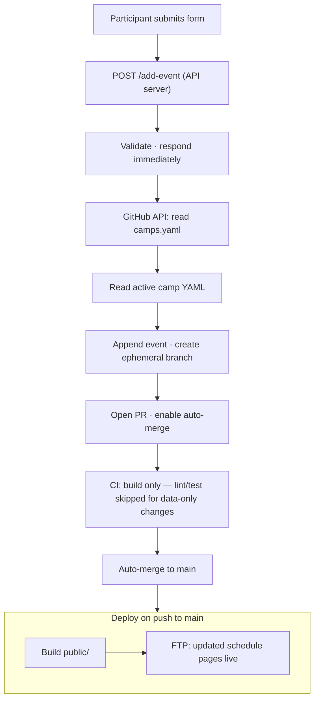
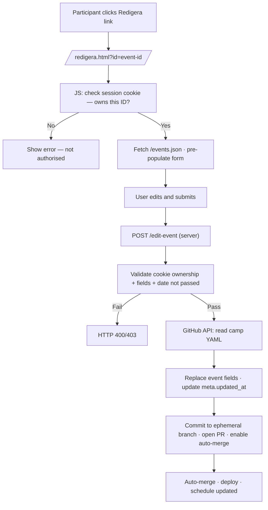

# SB Sommar – Architecture Overview

This project is a static, YAML-driven camp platform with a small Node.js API server for live event submissions.

The system is intentionally simple:

- No database
- No CMS
- No server-side rendering — HTML is generated at build time
- Git is the archive

---

## 1. Data Layer

Each camp has exactly one YAML file in `source/data/`:

```text
source/data/2025-06-syssleback.yaml
source/data/2025-08-syssleback.yaml
source/data/2026-06-syssleback.yaml
```

Each file contains:

- Camp metadata (name, dates, location)
- A list of events

Events are unique on the combination of `(title + date + start)`.

This is the single source of truth for all camp content.

---

## 2. Metadata Layer

`source/data/camps.yaml` is the central registry of all camps, past and present.

It contains:

- All camps (active, archived, and upcoming)
- Their date ranges
- Which file contains their events
- Which camp is currently active

Example entry:

```yaml
camps:
  - id: 2026-06-syssleback
    name: SB Sommar Juni 2026
    start_date: 2026-06-28
    end_date: 2026-07-05
    file: 2026-06-syssleback.yaml
    archived: false
    active: true
```

The site never hardcodes file names. It always reads from `camps.yaml` first.

Only one camp should have `active: true` at a time.

---

## 3. Active Camp and Event Submissions

During camp week, participants submit activities through the `/lagg-till.html` form.

The API server (`app.js`) handles each submission as follows:

1. Validates the incoming event data.
2. Responds immediately with a success confirmation — the form does not wait for the rest of the process.
3. Reads `source/data/camps.yaml` from GitHub via the Contents API.
4. Finds the active camp and reads its YAML file from GitHub.
5. Appends the new event and commits it to a temporary branch.
6. Opens a pull request with auto-merge enabled.
7. CI runs a build-only check (lint and tests are skipped for data-only changes — commits that only modify YAML files in `source/data/`).
8. The PR merges automatically. The deploy pipeline runs and the schedule is live within minutes.

The active camp's YAML file is always version-controlled. Git history provides a full audit trail of every event submitted through the form.



---

## 4. Archive Layer

After camp ends:

1. Set `active: false` for the camp in `source/data/camps.yaml`.
2. Set `archived: true`.
3. Commit the final YAML file — it becomes the permanent archive.
4. Deploy. The site now shows the next active camp, or the most recent archived camp if none is active.

No data is ever lost.

---

## 4a. Archive Page Rendering

At build time, `source/build/render-arkiv.js` produces `public/arkiv.html`.

The data source is `camps.yaml` — no per-camp event files are loaded.

Steps:

1. Filter `camps` to those with `archived: true`.
2. Sort descending by `start_date` (newest first).
3. Render a vertical timeline: each camp is one `<li>` in an `<ol class="timeline">`.
4. Each timeline item contains:
   - A `<button>` accordion header showing the camp name and year.
   - A hidden `<div>` panel with dates, location, information, and Facebook link.
5. The panel is hidden/shown by toggling `aria-expanded` and `hidden` via
   `source/assets/js/client/arkiv.js` — no framework.
6. Only one panel may be open at a time; the JS closes any previously open panel
   before opening the new one.

### Fields used from `camps.yaml`

| Field | Used for |
| --- | --- |
| `name` | Accordion header |
| `start_date` | Date range display; sort key |
| `end_date` | Date range display |
| `location` | Location line |
| `information` | Information paragraph (omitted if empty) |
| `link` | Facebook button (omitted if empty) |

Dates are formatted in Swedish: `D månadsnamn YYYY` (e.g. "22 juni 2025").

### Archive page files

| File | Role |
| --- | --- |
| `source/build/render-arkiv.js` | Renders `public/arkiv.html` at build time |
| `source/assets/js/client/arkiv.js` | Accordion open/close + ARIA state on the archive page |

### Archive page changes to existing files

| File | Change |
| --- | --- |
| `source/build/build.js` | Call `renderArkivPage(camps)` and write `public/arkiv.html` |
| `source/build/layout.js` | Add "Arkiv" nav link |

---

## 5. Rendering Logic

At build time:

1. Load `source/data/camps.yaml`.
2. Find the camp where `active: true`.
3. Load its YAML file.
4. Sort events chronologically.
5. Render HTML pages.

Fallback: if no camp is `active: true`, the camp with the most recent `start_date` is shown.

---

## 6. Project Structure

```text
source/data/      YAML source files (camps registry, per-camp events, locations)
source/content/   Markdown page sections
source/build/     Build scripts → generates public/
source/api/       API handlers (github.js, validate.js)
public/           Generated output — do not edit directly
app.js            Express server entry point
```

Key files:

| File | Role |
| ---- | ---- |
| `source/data/camps.yaml` | Registry of all camps; determines which is active |
| `source/data/local.yaml` | Predefined location list — the only place locations are defined |
| `source/data/YYYY-MM-name.yaml` | Per-camp event files, referenced from `camps.yaml` |
| `app.js` | Express (Node.js web server) — serves `public/`, handles `POST /add-event` and `POST /edit-event` |
| `public/events.json` | Generated at build time; all public event fields for the active camp |

---

## 7. Participant Event Editing — Session Cookie Architecture

### Overview

Participants who submit an event gain temporary ownership of that event,
tracked through a browser cookie. They can then edit the event until its
date passes. No server-side session store is used.

### Cookie design

| Property | Value |
| --- | --- |
| Name | `sb_session` |
| Content | JSON array of event ID strings |
| Max-Age | 7 days (604 800 s) |
| Secure | Yes (HTTPS only) |
| SameSite | Strict |
| HttpOnly | **No** — see note below |

**Why the cookie is not `httpOnly`:**
The schedule pages are static HTML, pre-rendered at build time. There is no
server-side rendering at request time. Client-side JavaScript is therefore the
only layer that can read the cookie and selectively show edit links for events
the current visitor owns. Making the cookie `httpOnly` would prevent this.
Security is maintained through server-side validation: the `/edit-event` endpoint
always verifies that the target event ID appears in the cookie sent with the
request. An attacker who cannot forge a session cookie they do not have cannot
edit events they do not own.

### Cookie lifecycle

1. User submits the add-activity form and accepts cookie consent.
2. Server validates the event, responds with `Set-Cookie: sb_session=…`.
3. The cookie contains the new event's ID merged with any IDs already in
   the existing cookie.
4. On every page load, `source/assets/js/client/session.js` reads the
   cookie, removes IDs for events whose dates have passed, and writes the
   cleaned cookie back (or deletes it if the array becomes empty).
5. Schedule pages read the cookie and attach "Redigera" links to matching
   event rows.

### /events.json

At build time, `source/build/build.js` writes `public/events.json` — a JSON
array of all public event fields for the active camp. The edit page
(`/redigera.html`) fetches this file client-side to pre-populate the edit
form with current event data.

### Edit endpoint

`POST /edit-event` handles edit submissions:

1. Read and parse the `sb_session` cookie from the request.
2. Confirm the target event ID is in the cookie array.
3. Validate the submitted fields (same rules as `POST /add-event`).
4. Confirm the event's date has not passed.
5. Read the camp YAML from GitHub, locate the event by ID, replace mutable
   fields, update `meta.updated_at`.
6. Commit to an ephemeral branch and open a PR with auto-merge — same
   pipeline as event additions.



### Cookie consent

Before the session cookie is set, the add-activity page prompts the user for
cookie consent (first submission only, per browser). The consent decision is
stored in `localStorage` under the key `sb_cookie_consent`. If the user
declines, the event is still submitted but no session cookie is set.

### New files

| File | Role |
| --- | --- |
| `source/assets/js/client/session.js` | Reads/cleans session cookie; injects edit links on schedule pages |
| `source/assets/js/client/cookie-consent.js` | Displays consent prompt; writes `localStorage` decision |
| `source/assets/js/client/redigera.js` | Edit form logic: load event data, validate, submit |
| `source/build/render-edit.js` | Renders static `/redigera.html` at build time |
| `source/api/edit-event.js` | Server-side edit handler: ownership check, YAML patch, GitHub PR |

### Modified files

| File | Change |
| --- | --- |
| `app.js` | Add `POST /edit-event` route; add cookie-parser middleware |
| `source/build/build.js` | Build `/redigera.html`; write `public/events.json` |
| `source/build/render.js` | Add `data-event-id` attribute to event rows |
| `source/api/github.js` | Add `updateEventInActiveCamp()` function |

---

## 8. Add-Activity Submit Flow — Field Locking and Progress Modal

### Submit flow stages

When the user presses "Skicka" and validation passes, the submit flow
proceeds through four stages before returning control to the user:

1. **Field lock** — all form inputs and the submit button are disabled
   immediately, preventing edits or re-submission during the async flow.
2. **Consent prompt** (if needed) — `cookie-consent.js` inserts the consent
   banner directly after the disabled submit button. The user accepts or
   declines. The banner removes itself before stage 3.
3. **Progress modal** — a modal dialog opens over the page with a spinner and
   the text "Skickar till GitHub…". The fetch begins.
4. **Result** — the modal content is replaced with a success or error state
   depending on the server response.

### Field locking

All `<input>`, `<select>`, and `<textarea>` elements inside `#event-form`
are disabled by wrapping the form body in a `<fieldset>` and setting
`fieldset.disabled = true`. This is simpler and more reliable than disabling
each element individually. CSS uses `opacity` and `cursor: not-allowed` on
`fieldset:disabled` to communicate the locked state visually.

### Progress modal

The modal is a `<div>` injected into `<body>` by `lagg-till.js` on first
submit. It is re-used on subsequent submissions ("Lägg till en till").

Structure:

```html
<div id="submit-modal" role="dialog" aria-modal="true" aria-labelledby="modal-heading" hidden>
  <div class="modal-backdrop"></div>
  <div class="modal-box">
    <h2 id="modal-heading"><!-- heading text set by JS --></h2>
    <!-- spinner / message / actions set by JS -->
  </div>
</div>
```

The backdrop covers the full viewport (fixed, full-width/height) and blocks
scroll via `overflow: hidden` on `<body>` while open. The modal box is
centered with flexbox.

Focus is trapped: when the modal opens, focus moves to the first focusable
element inside `.modal-box`. Tab and Shift+Tab wrap within the modal.

### States

| State | Heading | Content |
| --- | --- | --- |
| Loading | "Skickar…" | Spinner + "Skickar till GitHub…" |
| Success | "Aktiviteten är tillagd!" | Title, "Den syns i schemat om ungefär en minut.", optional no-edit note, two action buttons |
| Error | "Något gick fel" | Error message + "Försök igen" button |

### "Försök igen" and "Lägg till en till"

- **Försök igen**: closes the modal, sets `fieldset.disabled = false`,
  restores focus to the submit button. Form data is preserved so the user
  can correct the issue.
- **Lägg till en till**: closes the modal, calls `form.reset()`, sets
  `fieldset.disabled = false`, scrolls to top.

### Files affected

| File | Change |
| --- | --- |
| `source/build/render-add.js` | Wrap form fields in `<fieldset>`, remove `#result` section, add `#submit-modal` skeleton |
| `source/assets/js/client/lagg-till.js` | Implement lock/modal/state logic |
| `source/assets/cs/style.css` | Add `fieldset:disabled` style, modal backdrop, modal box |

---

## 9. Edit-Activity Submit Flow — Progress Modal

The edit-activity submit flow mirrors the add-activity flow (§8) but without a
consent step, and with success text appropriate for an update rather than a new
submission.

### Edit submit flow stages

When the user presses "Spara ändringar" and validation passes:

1. **Field lock** — all form inputs and the submit button are disabled
   immediately via `fieldset.disabled = true`.
2. **Progress modal** — a modal dialog opens over the page with a spinner and
   the text "Sparar till GitHub…". The fetch begins.
3. **Result** — the modal content is replaced with a success or error state
   depending on the server response.

### Edit form field locking

The edit form wraps all its fields in a `<fieldset>` (same pattern as the add
form). Setting `fieldset.disabled = true` disables all child inputs and the
submit button atomically. CSS communicates the locked state visually via
`opacity` and `cursor: not-allowed` on `fieldset:disabled`.

### Edit progress modal

The modal uses the same `#submit-modal` HTML skeleton and CSS as the add form —
`role="dialog"`, `aria-modal="true"`, `aria-labelledby="modal-heading"`, focus
trapping, and `body.modal-open { overflow: hidden }`.

### Edit modal states

| State | Heading | Content |
| --- | --- | --- |
| Loading | "Sparar…" | Spinner + "Sparar till GitHub…" |
| Success | "Aktiviteten är uppdaterad!" | Title, "Den syns i schemat om ungefär en minut.", "Gå till schemat →" link |
| Error | "Något gick fel" | Error message + "Försök igen" button |

### Edit "Försök igen"

Closes the modal, sets `fieldset.disabled = false`, restores focus to the submit
button. Form data is preserved so the user can correct and resubmit.

### Edit files affected

| File | Change |
| --- | --- |
| `source/build/render-edit.js` | Wrap form fields in `<fieldset>`, remove `#result` section, add `#submit-modal` skeleton |
| `source/assets/js/client/redigera.js` | Implement lock/modal/state logic |

---

## 10. Design Philosophy

- YAML is the database
- Git is the archive
- Simplicity over cleverness
- One clear data contract
- No hidden state

The system must remain:

- Predictable
- Minimal
- Maintainable
