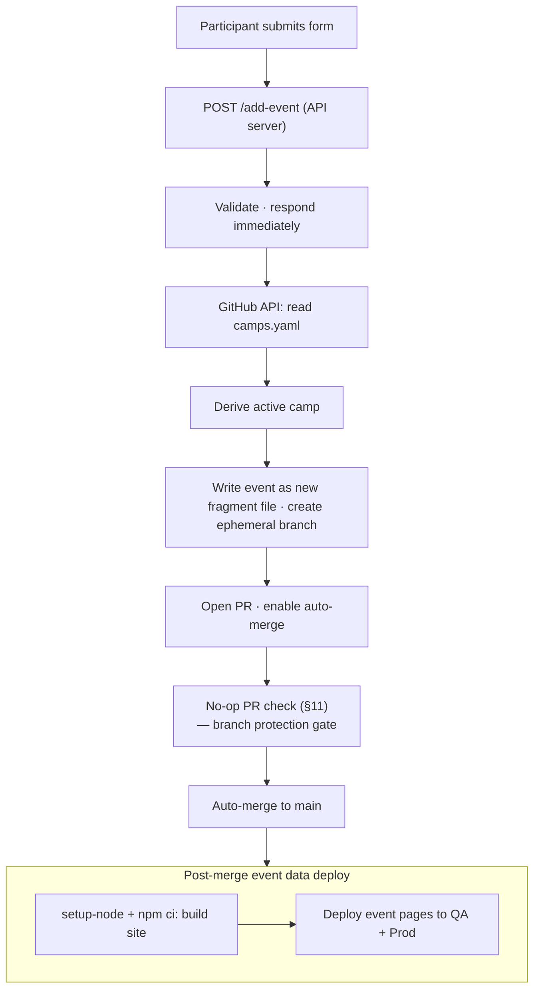

# SB Sommar – Architecture: Data Layer

Camp YAML files, the central metadata registry, active-camp resolution, the archive layer, the shared footer, and search-engine blocking.

Part of [the architecture index](./index.md). Section IDs (`03-§N.M`) are stable and cited from code; they do not encode the file path.

---

## 1. Data Layer

Each camp has exactly one YAML file in `source/data/`:

```text
source/data/2025-06-syssleback.yaml
source/data/2025-08-syssleback.yaml
source/data/2026-06-syssleback.yaml
```

Each file contains:

- Camp metadata (name, dates, location)
- A list of events

Events are unique on the combination of `(title + date + start)`.

This is the single source of truth for all camp content.

### 1.1 Per-camp event fragments

So that participants can submit activities concurrently without their pull
requests conflicting, each camp's events come from two places that the build
treats as a single set (02-§109.1):

- the camp's YAML file (`source/data/<file>`), and
- an optional per-camp fragment directory `source/data/<stem>/`, where `<stem>`
  is the camp's `file` without its `.yaml` extension. For
  `2026-06-syssleback.yaml` the directory is `source/data/2026-06-syssleback/`.

```text
source/data/2026-06-syssleback.yaml          ← camp file (camp header + events:)
source/data/2026-06-syssleback/              ← fragment directory (optional)
  schack-2026-06-29-1400.yaml                ← one event each, top-level `event:`
  fika-2026-06-29-1500.yaml
```

Each fragment file is named `<event-id>.yaml` and holds a single top-level
`event:` mapping with exactly the fields of one entry in the camp file's
`events:` list (02-§109.2). The file name without `.yaml` equals `event.id`
(02-§109.3).

Because every submission writes a brand-new file whose name is derived from the
event id, two submissions in flight never modify the same file. Their pull
requests cannot textually conflict, so the merge queue merges them in any order
without manual intervention — this is the root-cause fix for the burst-conflict
problem (02-§109.7).

A shared loader, `loadCampEvents(dataDir, campFile)` in
`source/build/load-events.js`, returns the merged, de-duplicated event list for
any camp: the camp file's `events:` plus every `event:` mapping in the camp's
fragment directory. It enforces structural integrity (02-§109.15, 02-§109.19,
02-§109.20):

- a fragment's `event.id` must equal its filename stem;
- ids must be unique across the camp file and all fragments;
- if an id appears in both the file and a fragment, the fragment wins and a
  warning is logged.

Both `build.js` (active camp) and `render-arkiv.js` (archived camps) load events
through this helper, so every view — schedule, today, live, per-event pages,
`events.json`, RSS, iCal, and archive — is built from the same merged set
(02-§109.13, 02-§109.16).

The fragment directory is optional; a camp with none behaves exactly as before
(02-§109.4). A periodic compaction step that folds fragments back into the camp
file is tracked as a separate follow-up; until it runs, fragments simply
accumulate and the loader reads them alongside the file.

---

## 2. Metadata Layer

`source/data/camps.yaml` is the central registry of all camps, past and present.

It contains:

- All camps (active, archived, and upcoming)
- Their date ranges
- Which file contains their events
- Which camp is currently active

Example entry:

```yaml
camps:
  - id: 2026-06-syssleback
    name: SB Sommar Juni 2026
    start_date: 2026-06-28
    end_date: 2026-07-05
    file: 2026-06-syssleback.yaml
    archived: false
```

The site never hardcodes file names. It always reads from `camps.yaml` first.

The active camp is **derived at build time and API request time** — there is
no manual `active` flag. The derivation rules (in priority order):

1. **On dates** — today falls within `start_date..end_date` (inclusive).
2. **Next upcoming** — nearest future `start_date`.
3. **Most recent** — latest `end_date`, even if archived.

If two camps overlap, the one with the earlier `start_date` wins.

The derivation logic lives in `source/scripts/resolve-active-camp.js` and is
shared by `build.js` and the API (`github.js`).

### QA camp isolation

Camps may have an optional `qa: true` field. QA camps are filtered based on
the `BUILD_ENV` environment variable:

- **Production** (`BUILD_ENV=production`): QA camps are excluded from
  the camps array at the top of `build.js`, before the array is passed
  to `resolveActiveCamp()` or any rendering function. This ensures QA
  camps never appear in production output (schedule, index camp list,
  archive, RSS, calendar, or API responses).
- **QA** (`BUILD_ENV=qa`): QA camps that are on dates take priority over
  non-QA camps, ensuring the QA camp is always active in QA.
- **Local** (`BUILD_ENV` unset): No filtering — all camps are included
  and normal derivation rules apply.

Two QA-only camps coexist in `camps.yaml` to provide a continuous QA
testing window without overlapping the real-camp season:

- A spring QA camp (`qa-thisweek`) runs through the off-season and
  closes when the next real camp opens for editing (its
  `opens_for_editing`), so QA stays testable right up to the point the
  real camp takes over, leaving the real-camp window QA-free.
- An autumn QA camp (`qa-testcamp`) covers October 1 through December
  31 of the current year, reopening QA testing once the real-camp
  season ends.

See `02-requirements/event-data.md §42` for the full data model and seasonal rules.

---

## 3. Active Camp and Event Submissions

During camp week, participants submit activities through the `/lagg-till.html` form.

The API server (`app.js`) handles each submission as follows:

1. Validates the incoming event data, including security scanning for injection patterns and link protocol validation (see [`ci-and-deploy.md`](./ci-and-deploy.md) §11.6).
2. Responds immediately with a success confirmation — the form does not wait for the rest of the process.
3. Reads `source/data/camps.yaml` from GitHub via the Contents API.
4. Derives the active camp from dates.
5. Writes the new event as a **new fragment file** `source/data/<stem>/<event-id>.yaml` (a single top-level `event:` mapping) — never by appending to the camp YAML file (02-§109.5). Before any branch is created, the serialised fragment is parsed and confirmed to contain the new event id (02-§102.5); on a parse failure nothing is written to git.
6. Opens a pull request with auto-merge enabled. Because the file is brand-new and its name is unique to the submission, the pull request cannot conflict with any other in-flight submission (02-§109.7).
7. The event data PR check (see [`ci-and-deploy.md`](./ci-and-deploy.md) §11) runs — a no-op that satisfies branch protection.
8. The PR merges automatically via auto-merge.
9. The post-merge event data deploy workflow (see [`ci-and-deploy.md`](./ci-and-deploy.md) §11) installs production dependencies via `setup-node` + `npm ci --omit=dev`, builds the site, and uploads event-data pages to QA and Production.

The updated schedule is visible to participants within minutes of submission.

The active camp's YAML file is always version-controlled. Git history provides a full audit trail of every event submitted through the form.



### 3.1 Batch event submissions (recurring activities)

A batch endpoint `POST /add-events` (Node.js) and `POST /api/add-events` (PHP)
accepts the same fields as the single-event endpoint but with `dates` (an array)
instead of `date`. <!-- 03-§3.1 -->

The flow is identical to the single-event flow above, with two differences:

1. **Validation**: every date in the array is validated against camp range,
   past-date rules, and uniqueness `(title + date + start)` before any write.
   If any date fails, the entire batch is rejected. <!-- 03-§3.1a -->
2. **Commit**: each date becomes its own new fragment file
   `source/data/<stem>/<event-id>.yaml`; all of the batch's fragment files are
   committed on a single branch and PR — not one PR per event. The file names are
   distinct (one per date), so even the batch's own files never collide
   (02-§109.6). <!-- 03-§3.1b -->

The session cookie is updated with all new event IDs (when consent is given).

### 3.2 Day grid on add-activity form

The add-activity form replaces the native `<input type="date">` with a grid of
day buttons rendered at build time from the active camp's `start_date` and
`end_date`. <!-- 03-§3.2 -->

Each button shows the Swedish weekday abbreviation and date (e.g. "Mån 28/7").
A "Återkommande" toggle switches the grid between single-select (default) and
multi-select mode. In single-select, exactly one day is selected. In
multi-select, multiple days can be toggled on/off. <!-- 03-§3.2a -->

Client-side date filtering: when today falls within the camp period, only days
from today onward are shown. This uses the same date comparison logic as the
existing past-date blocking ([`forms-and-api.md`](./forms-and-api.md) §13). <!-- 03-§3.2b -->

### 3.3 API error classification

When a GitHub API call fails during event submission (add, batch-add, or edit),
the PHP API classifies the error before returning it to the client. <!-- 03-§3.3 -->

| HTTP status from GitHub | Category | Swedish user message | Actionable? |
| ----------------------- | -------- | -------------------- | ----------- |
| 401 / 403 (no rate-limit) | Auth | Servern kunde inte ansluta till GitHub. Kontakta arrangören. | No — config |
| 403 (rate-limit) / 429 | Rate limit | För många förfrågningar just nu. Försök igen om några minuter. | Yes — wait |
| 409 / 422 | Conflict | En skrivkonflikt uppstod. Försök igen. | Yes — retry |
| 5xx | GitHub error | GitHub har tillfälliga problem. Försök igen om en stund. | Yes — wait |
| curl timeout / no response | Network | Kunde inte nå GitHub. Kontrollera att tjänsten är tillgänglig. | Maybe |
| Other | Unknown | Ett oväntat fel uppstod. Försök igen eller kontakta arrangören. | Maybe |

The classification is implemented in a single helper method so all three
mutation endpoints share the same logic. Error messages never expose tokens,
file paths, or stack traces. <!-- 03-§3.3a -->

### 3.4 Fragment writes, edits, and deletes

Every add and batch-add writes new fragment files rather than appending to the
camp YAML file (§1.1). The mutation endpoints behave as follows: <!-- 03-§3.4 -->

- **Add** — one new file `source/data/<stem>/<event-id>.yaml` containing the
  event as a single `event:` mapping, on one ephemeral branch and PR
  (02-§109.5).
- **Batch add** — one new fragment file per date, all on a single branch and PR
  (02-§109.6).
- If a fragment with the target id already exists (a genuine duplicate of the
  same activity at the same date and start time), the create call returns
  HTTP 422 and the API surfaces the "En skrivkonflikt uppstod" message (§3.3)
  rather than overwriting the existing event (02-§109.8). <!-- 03-§3.4a -->

Edit and delete operate only on the event's fragment file (02-§109.9):
<!-- 03-§3.4b -->

1. If `source/data/<stem>/<event-id>.yaml` exists, the operation targets that
   fragment — **edit** rewrites it in place (preserving `id` and
   `meta.created_at`, bumping `meta.updated_at`); **delete** removes the file
   (02-§109.10, 02-§109.11).
2. If no fragment exists for the id, the operation makes no change and fails with
   a clear Swedish error; it never writes the camp YAML file (02-§109.12).

No add, edit, or delete writes the camp YAML file (02-§109.26). An open camp's
events therefore live entirely in fragment files: a split step moves a camp's
seeded events into fragments when it opens (tracked separately) and compaction
folds them back after archival (§1.1). Between those steps the camp YAML file's
`events:` list is empty, so concurrent edits and deletes of different events
never touch the same file and their pull requests can never conflict or go
stale.

---

## 4. Archive Layer

After camp ends:

1. Set `archived: true` for the camp in `source/data/camps.yaml`.
2. Commit the change — the YAML file becomes the permanent archive.
3. Deploy. The system automatically derives the next active camp from dates.

No data is ever lost.

---

## 4a. Archive Page Rendering

At build time, `source/build/render-arkiv.js` produces `public/arkiv.html`.

Data sources:

- `camps.yaml` — camp metadata (name, dates, location, information, link).
- Per-camp events, loaded via the shared `loadCampEvents()` helper (§1.1) — the
  camp file's `events:` merged with any fragment files — for the event list
  inside each accordion panel (02-§109.13).

Steps:

1. Filter `camps` to those with `archived: true`.
2. Sort descending by `start_date` (newest first).
3. For each archived camp, load its events with `loadCampEvents()` (camp file
   `events:` merged with any fragments — §1.1) and pass the events array to the
   template.
4. Render a vertical timeline: each camp is one `<li>` in an `<ol class="timeline">`.
5. Each timeline item contains:
   - A `<button>` accordion header showing the camp name, with date range and
     location in subdued text to the right.
   - A hidden `<div>` panel with:
     - Facebook logo link (if `link` is non-empty), using the image at
       `images/facebook-ikon.webp`.
     - Camp metadata (dates, location).
     - Information paragraph (if non-empty).
     - Event list grouped by day, using the same row format as the schedule page.
6. The panel is hidden/shown by toggling `aria-expanded` and `hidden` via
   `source/assets/js/client/arkiv.js` — no framework.
7. Only one panel may be open at a time; the JS closes any previously open panel
   before opening the new one.
8. The JS toggles a CSS class on the active timeline dot to highlight the
   selected camp on the timeline.

### Fields used from `camps.yaml`

| Field | Used for |
| --- | --- |
| `name` | Accordion header (primary text) |
| `start_date` | Date range display; sort key; header metadata |
| `end_date` | Date range display; header metadata |
| `location` | Header metadata (gray text); location line in panel |
| `information` | Information paragraph (omitted if empty) |
| `link` | Facebook logo link (omitted if empty) |
| `file` | Path to per-camp event YAML for event list |

Dates are formatted in Swedish: `D månadsnamn YYYY` (e.g. "22 juni 2025").

### Archive page files

| File | Role |
| --- | --- |
| `source/build/render-arkiv.js` | Renders `public/arkiv.html` at build time |
| `source/assets/js/client/arkiv.js` | Accordion open/close + ARIA state on the archive page |

### Archive page changes to existing files

| File | Change |
| --- | --- |
| `source/build/build.js` | Call `renderArkivPage(camps)` and write `public/arkiv.html` |
| `source/build/layout.js` | Add "Arkiv" nav link |

---

## 4b. Shared Site Footer

Every page produced by the build includes a `<footer class="site-footer">` element
at the bottom of `<body>`.

### Content source

Footer content lives in `source/content/footer.md`. Non-technical contributors
can edit this file to change the footer on all pages without touching any template
or render function.

### Build-time rendering

`source/build/build.js`:

1. Reads `source/content/footer.md` at the start of the build, before rendering
   any page.
2. Converts the Markdown to HTML using `convertMarkdown()` from
   `source/build/render-index.js` (powered by the `marked` library; the same
   pipeline used for homepage sections).
3. If the file does not exist, `footerHtml` is set to an empty string — no error,
   no crash.
4. Passes `footerHtml` as an argument to every render function.

### Render functions

Each render function (`renderSchedulePage`, `renderTodayPage`, `renderIdagPage`,
`renderAddPage`, `renderEditPage`, `renderArkivPage`, `renderIndexPage`) accepts
`footerHtml` as its last argument. It calls `pageFooter(footerHtml)` from
`source/build/layout.js` and places the result immediately before `</body>`.

`pageFooter(footerHtml)`:

- Returns `<footer class="site-footer">…</footer>` when `footerHtml` is non-empty.
- Returns an empty string when `footerHtml` is empty (file-missing fallback).

### No duplication

No render function contains literal footer text. The Markdown file is the single
source of truth. Updating `footer.md` and rebuilding changes the footer on every
page simultaneously.

### Files changed

| File | Change |
| --- | --- |
| `source/content/footer.md` | New file — footer content in Markdown |
| `source/build/layout.js` | Add `pageFooter(footerHtml)` |
| `source/build/build.js` | Load `footer.md`, convert to HTML, pass to all render calls |
| `source/build/render.js` | Accept `footerHtml`; inject via `pageFooter()` |
| `source/build/render-today.js` | Accept `footerHtml`; inject via `pageFooter()` |
| `source/build/render-idag.js` | Accept `footerHtml`; inject via `pageFooter()` |
| `source/build/render-add.js` | Accept `footerHtml`; inject via `pageFooter()` |
| `source/build/render-edit.js` | Accept `footerHtml`; inject via `pageFooter()` |
| `source/build/render-arkiv.js` | Accept `footerHtml`; inject via `pageFooter()` |
| `source/build/render-index.js` | Accept `footerHtml`; inject via `pageFooter()` |
| `source/assets/cs/style.css` | Add `.site-footer` styles |

---

## 4c. Search Engine and Crawler Blocking

The site is intentionally hidden from search engines. Two mechanisms enforce this:

### robots.txt

`source/build/build.js` writes `public/robots.txt` during the build:

```text
User-agent: *
Disallow: /
```

This tells well-behaved crawlers not to index any page.

### Meta robots tag

Every HTML page includes a `<meta name="robots" content="noindex, nofollow">` tag
in its `<head>` section. This is the browser-level signal that reinforces
`robots.txt` for crawlers that follow the meta tag standard.

Each render function (`renderSchedulePage`, `renderTodayPage`, `renderIdagPage`,
`renderAddPage`, `renderEditPage`, `renderArkivPage`, `renderIndexPage`) emits
the tag as part of its `<head>` block.

### Crawler-blocking files changed

| File | Change |
| --- | --- |
| `source/build/build.js` | Write `public/robots.txt` during build |
| `source/build/render.js` | Add `<meta name="robots">` to `<head>` |
| `source/build/render-today.js` | Add `<meta name="robots">` to `<head>` |
| `source/build/render-idag.js` | Add `<meta name="robots">` to `<head>` |
| `source/build/render-add.js` | Add `<meta name="robots">` to `<head>` |
| `source/build/render-edit.js` | Add `<meta name="robots">` to `<head>` |
| `source/build/render-arkiv.js` | Add `<meta name="robots">` to `<head>` |
| `source/build/render-index.js` | Add `<meta name="robots">` to `<head>` |

---
