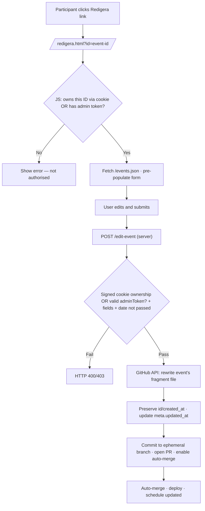

# SB Sommar – Architecture: Forms and API

Participant event editing (session cookie architecture), per-field inline validation, participant event deletion, the add- and edit-activity submit flows, form time-gating, and the form draft cache.

Part of [the architecture index](./index.md). Section IDs (`03-§N.M`) are stable and cited from code; they do not encode the file path.

---

## 7. Participant Event Editing — Session Cookie Architecture

### Overview

Participants who submit an event gain temporary ownership of that event,
tracked through a browser cookie. They can then edit the event until its
date passes. No server-side session store is used.

### Cookie design

| Property | Value |
| --- | --- |
| Name | `sb_session` |
| Content | JSON array of ownership entries (`{ id, exp, sig }`) |
| Max-Age | 7 days (604 800 s) |
| Secure | Yes (HTTPS only) |
| SameSite | Strict |
| HttpOnly | **No** — see note below |

**Why the cookie is not `httpOnly`:**
The schedule pages are static HTML, pre-rendered at build time. There is no
server-side rendering at request time. Client-side JavaScript is therefore the
only layer that can read the cookie and selectively show edit links for events
the current visitor owns. Making the cookie `httpOnly` would prevent this.
Security is maintained through server-side validation: edit and delete endpoints
verify that the cookie contains a signed ownership entry for the target event.
The signature uses a server-side `SESSION_SECRET` and covers both `id` and
`exp`, so a caller can read the event ID for UI purposes without being able to
mint ownership for public IDs or extend an expired ownership entry.

Legacy cookies that contain plain event ID strings may be read by the client for
display or cleanup, but the server treats them as unauthorised for edit/delete.

### Cookie lifecycle

1. User submits the add-activity form and accepts cookie consent.
2. Server validates the event, responds with `Set-Cookie: sb_session=…`.
3. The cookie contains the event's signed ownership entry merged with any
   existing valid ownership entries. Existing valid entries are reissued so
   their signed expiry matches the refreshed cookie lifetime.
4. On every page load, `source/assets/js/client/session.js` reads the
   cookie, removes entries for events whose dates have passed, and writes the
   cleaned cookie back (or deletes it if the array becomes empty). The client
   preserves each entry's signature; it never creates new signatures.
   The write-back must include the same `Domain` attribute the server used,
   read from a `data-cookie-domain` attribute injected on `<body>` at build time.
5. Before the expiry cleanup, `session.js` detects duplicate `sb_session`
   cookies (e.g. one with `Domain` and one without, caused by a historical
   bug in `removeIdFromCookie`). If duplicates are found, all ownership entries
   are merged and deduplicated, both cookie variants are deleted, and a single
   correct cookie is written back. This repair is transparent to the user.
6. Schedule pages read the cookie and attach "Redigera" links to matching
   event rows.
7. The edit page (`redigera.html`) includes a collapsible "Om din cookie"
   section that displays the cookie contents: protocol, cookie domain,
   stored event ownership entries with their status (active / expired / not
   found in schema / legacy-unverifiable), and whether automatic repair was
   performed.

### /events.json

At build time, `source/build/build.js` writes `public/events.json` — a JSON
array of all public event fields for the active camp. The edit page
(`/redigera.html`) fetches this file client-side to pre-populate the edit
form with current event data.

### Edit endpoint

`POST /edit-event` handles edit submissions:

1. Read and parse the `sb_session` cookie from the request.
2. Confirm the target event ID has a valid signed ownership entry **or** that the
   request body contains a valid `adminToken`.
3. Validate the submitted fields (same rules as `POST /add-event`).
4. Confirm the event's date has not passed.
5. Rewrite the event's fragment file `source/data/<stem>/<event-id>.yaml` in
   place — replace mutable fields, preserve `id` and `meta.created_at`, update
   `meta.updated_at`. If no fragment exists for the id, make no change and return
   an error; the camp YAML file is never rewritten (02-§109.9, §109.12).
6. Commit to an ephemeral branch and open a PR with auto-merge — same
   pipeline as event additions.



### Cookie consent

Before the session cookie is set, the add-activity page prompts the user for
cookie consent (first submission only, per browser). The consent decision is
stored in `localStorage` under the key `sb_cookie_consent`. If the user
declines, the event is still submitted but no session cookie is set.

### New files

| File | Role |
| --- | --- |
| `source/assets/js/client/session.js` | Reads/cleans session cookie; injects edit links on schedule pages |
| `source/assets/js/client/cookie-consent.js` | Displays consent prompt; writes `localStorage` decision |
| `source/assets/js/client/redigera.js` | Edit form logic: load event data, validate, submit |
| `source/build/render-edit.js` | Renders static `/redigera.html` at build time |
| `source/api/edit-event.js` | Server-side edit handler: ownership check, YAML patch, GitHub PR |

### Modified files

| File | Change |
| --- | --- |
| `app.js` | Add `POST /edit-event` route; add cookie-parser middleware |
| `source/build/build.js` | Build `/redigera.html`; write `public/events.json` |
| `source/build/render.js` | Add `data-event-id` attribute to event rows |
| `source/api/github.js` | Add `updateEventInActiveCamp()` function |

---

## 7a. Per-Field Inline Validation Errors

Both the add-activity and edit-activity forms validate required fields
on submit. Each validation error is displayed inline, directly below the
input it relates to — not in a single aggregated error box.

### HTML structure

Each `.field` div contains an error `<span>` after its input element:

```html
<span class="field-error" id="err-title" hidden></span>
```

The input links to its error span via `aria-describedby="err-title"`.

### Validation flow (client-side)

1. On submit, JS iterates over each required field.
2. For each invalid field: set `aria-invalid="true"` on the input,
   populate and show its `.field-error` span.
3. For each valid field: remove `aria-invalid`, hide the error span.
4. If any field is invalid, focus the first invalid input and cancel submit.
5. If all fields are valid, proceed to the submit flow (§8/§9).

### Clearing errors

Errors are cleared on the next submit attempt — not on individual
keystroke or blur. This keeps the JS simple and avoids distracting
the user while they are still filling in the form.

### Blur validation for the link field

The optional link field validates on blur — unlike required fields which
validate on submit. When the user leaves the field and the value is
non-empty, `lagg-till.js` checks:

1. The value starts with `http://` or `https://` (case-insensitive).
2. The value contains at least one dot after the protocol (basic domain check).

If either check fails, `setFieldError` shows the error below the field.
The error is cleared on the `input` event so the user gets immediate
feedback as they correct the value. The submit flow also checks the link
field error state — submission is blocked while the error is visible.

### Accessibility

- `aria-invalid="true"` communicates the error state to screen readers.
- `aria-describedby` links each input to its error message so the
  error is announced when the input receives focus.

### Inline validation files changed

| File | Change |
| --- | --- |
| `source/build/render-add.js` | Add `.field-error` spans and `aria-describedby` to inputs; remove `#form-errors` div |
| `source/build/render-edit.js` | Same changes as render-add.js |
| `source/assets/js/client/lagg-till.js` | Rewrite validation to show per-field errors |
| `source/assets/js/client/redigera.js` | Same validation rewrite |
| `source/assets/cs/style.css` | Add `.field-error` and `[aria-invalid="true"]` styles; remove `.form-errors` styles |

---

## 7b. Participant Event Deletion

Participants who own an event can delete it from the edit page. Deletion removes
the event's fragment file using the same ephemeral-branch → PR → auto-merge
pipeline as additions and edits, and never rewrites the camp's YAML file
(02-§109.9, §109.26).

### Server-side flow

```text
POST /delete-event  { id }
  ├─ verify sb_session signed ownership for id
  ├─ reject if no valid ownership/admin token → 403
  ├─ reject if editing period closed → 400
  ├─ reject if event date < today → 400
  └─ removeEventFromActiveCamp(id)
       ├─ resolve active camp from camps.yaml
       ├─ locate the event's fragment source/data/<stem>/<id>.yaml
       ├─ no fragment for id → error, no change (02-§109.12)
       ├─ create ephemeral branch event-delete/<id>
       ├─ delete the fragment file
       ├─ open PR → auto-merge (squash)
       └─ return success
```

### Client-side flow

1. User clicks "Radera aktivitet" button on the edit page.
2. Confirmation dialog appears with event title and two buttons.
3. On confirm, progress modal opens (same pattern as edit submit flow §9).
4. `POST /delete-event` with `credentials: 'include'`.
5. On success: event ID removed from `sb_session` cookie; confirmation shown.
6. On failure: error shown with retry option.

### Delete endpoint URL derivation

The build step derives the delete URL from the `API_URL` environment
variable by replacing a trailing `/add-event` path segment with
`/delete-event`; if `API_URL` does not end with `/add-event`, the delete
URL falls back to `/delete-event`.

### Delete-event files changed

| File | Change |
| --- | --- |
| `app.js` | Add `POST /delete-event` route |
| `source/api/github.js` | `removeEventFromActiveCamp()` deletes the event's fragment file (02-§109.11) |
| `source/build/render-edit.js` | Add delete button and confirmation dialog HTML |
| `source/assets/js/client/redigera.js` | Add delete button handler, confirmation, progress modal |

---

## 8. Add-Activity Submit Flow — Field Locking and Progress Modal

### Submit flow stages

When the user presses "Skicka" and validation passes, the submit flow
proceeds through four stages before returning control to the user:

1. **Field lock** — all form inputs and the submit button are disabled
   immediately, preventing edits or re-submission during the async flow.
2. **Consent prompt** (if needed) — `cookie-consent.js` renders the consent
   prompt inside the existing `#submit-modal` as a modal dialog with backdrop
   and focus trap. The user accepts or declines. The modal content then
   transitions to the progress state (stage 3) without closing.
3. **Progress modal** — a modal dialog opens over the page with a spinner and
   the text "Skickar till GitHub…". The fetch begins.
4. **Result** — the modal content is replaced with a success or error state
   depending on the server response.

### Field locking

All `<input>`, `<select>`, and `<textarea>` elements inside `#event-form`
are disabled by wrapping the form body in a `<fieldset>` and setting
`fieldset.disabled = true`. This is simpler and more reliable than disabling
each element individually. CSS uses `opacity` and `cursor: not-allowed` on
`fieldset:disabled` to communicate the locked state visually.

### Progress modal

The modal is a `<div>` injected into `<body>` by `lagg-till.js` on first
submit. It is re-used on subsequent submissions ("Lägg till en till").

Structure:

```html
<div id="submit-modal" role="dialog" aria-modal="true" aria-labelledby="modal-heading" hidden>
  <div class="modal-backdrop"></div>
  <div class="modal-box">
    <h2 id="modal-heading"><!-- heading text set by JS --></h2>
    <!-- spinner / message / actions set by JS -->
  </div>
</div>
```

The backdrop covers the full viewport (fixed, full-width/height) and blocks
scroll via `overflow: hidden` on `<body>` while open. The modal box is
centered with flexbox.

Focus is trapped: when the modal opens, focus moves to the first focusable
element inside `.modal-box`. Tab and Shift+Tab wrap within the modal.

### States

| State | Heading | Content |
| --- | --- | --- |
| Loading | "Skickar…" | Spinner + "Skickar till GitHub…" |
| Success | "Aktiviteten är tillagd!" | Title, "Den syns i schemat inom någon minut, men ibland kan det ta upp till 15 minuter.", cache-reload tip note, optional no-edit note, two action buttons |
| Error | "Något gick fel" | Error message + "Försök igen" button |

### "Försök igen" and "Lägg till en till"

- **Försök igen**: closes the modal, sets `fieldset.disabled = false`,
  restores focus to the submit button. Form data is preserved so the user
  can correct the issue.
- **Lägg till en till**: closes the modal, calls `form.reset()`, sets
  `fieldset.disabled = false`, scrolls to top.

### Files affected

| File | Change |
| --- | --- |
| `source/build/render-add.js` | Wrap form fields in `<fieldset>`, remove `#result` section, add `#submit-modal` skeleton |
| `source/assets/js/client/lagg-till.js` | Implement lock/modal/state logic |
| `source/assets/cs/style.css` | Add `fieldset:disabled` style, modal backdrop, modal box |

---

## 9. Edit-Activity Submit Flow — Progress Modal

The edit-activity submit flow mirrors the add-activity flow (§8) but without a
consent step, and with success text appropriate for an update rather than a new
submission.

### Edit submit flow stages

When the user presses "Spara ändringar" and validation passes:

1. **Field lock** — all form inputs and the submit button are disabled
   immediately via `fieldset.disabled = true`.
2. **Progress modal** — a modal dialog opens over the page with a spinner and
   the text "Sparar till GitHub…". The fetch begins.
3. **Result** — the modal content is replaced with a success or error state
   depending on the server response.

### Edit form field locking

The edit form wraps all its fields in a `<fieldset>` (same pattern as the add
form). Setting `fieldset.disabled = true` disables all child inputs and the
submit button atomically. CSS communicates the locked state visually via
`opacity` and `cursor: not-allowed` on `fieldset:disabled`.

### Edit progress modal

The modal uses the same `#submit-modal` HTML skeleton and CSS as the add form —
`role="dialog"`, `aria-modal="true"`, `aria-labelledby="modal-heading"`, focus
trapping, and `body.modal-open { overflow: hidden }`.

### Edit modal states

| State | Heading | Content |
| --- | --- | --- |
| Loading | "Sparar…" | Spinner + "Sparar till GitHub…" |
| Success | "Aktiviteten är uppdaterad!" | Title, "Den syns i schemat inom någon minut, men ibland kan det ta upp till 15 minuter.", cache-reload tip note, "Gå till schemat →" link |
| Error | "Något gick fel" | Error message + "Försök igen" button |

### Edit "Försök igen"

Closes the modal, sets `fieldset.disabled = false`, restores focus to the submit
button. Form data is preserved so the user can correct and resubmit.

### Edit files affected

| File | Change |
| --- | --- |
| `source/build/render-edit.js` | Wrap form fields in `<fieldset>`, remove `#result` section, add `#submit-modal` skeleton |
| `source/assets/js/client/redigera.js` | Implement lock/modal/state logic |

---

## 13. Form Time-Gating

The add-activity and edit-activity forms are only usable during a defined period
around the active camp. Outside this period, submissions are rejected.

### 13.1 Period definition

Each camp in `camps.yaml` has an `opens_for_editing` field (see `05-DATA_CONTRACT.md §1`).
The submission period runs from `opens_for_editing` through `end_date + 1 day`
(inclusive on both ends). Dates are compared as plain `YYYY-MM-DD` strings — no
timezone handling.

### 13.2 Build-time data passing

At build time, `render-add.js` and `render-edit.js` read `opens_for_editing` and
`end_date` from the active camp and embed them as `data-opens` and `data-closes`
attributes on the `<form>` element. The closes date is computed as `end_date + 1 day`.

### 13.3 Client-side gating

`lagg-till.js` and `redigera.js` read the `data-opens` and `data-closes` attributes
at page load and compare against today's date (`new Date().toISOString().slice(0, 10)`).

If outside the period:

1. All form fields receive reduced opacity via a CSS class.
2. The submit button is disabled.
3. A message is shown above the form:
   - Before opening: "Formuläret öppnar den {formatted date}."
   - After closing: "Lägret är avslutat."

### 13.4 Server-side gating

`app.js` reads `opens_for_editing` and `end_date` from the active camp in
`camps.yaml` (already fetched from GitHub). Both `POST /add-event` and
`POST /edit-event` check the current date against the period before processing
the request. Requests outside the period receive HTTP 403 with a Swedish error
message.

### 13.5 Files changed

| File | Change |
| --- | --- |
| `source/data/camps.yaml` | Add `opens_for_editing` to every camp entry |
| `docs/05-DATA_CONTRACT.md` | Document the new field |
| `source/build/render-add.js` | Embed `data-opens` and `data-closes` on form |
| `source/build/render-edit.js` | Embed `data-opens` and `data-closes` on form |
| `source/assets/js/client/lagg-till.js` | Client-side date check and form disabling |
| `source/assets/js/client/redigera.js` | Client-side date check and form disabling |
| `app.js` | Server-side date check on both endpoints |

### 13.6 Admin bypass before the camp opens

Administrators can open the add-activity and edit-activity forms before
`opens_for_editing`. The bypass is one-sided: it only opens the pre-period
lock. After `end_date + 1 day` the forms stay locked for everyone so finished
camps cannot be altered retroactively through the website.

Client side (`lagg-till.js`, `redigera.js`):

1. When the locked state applies because `today < opens`, the script also
   checks for a valid admin token (same extraction as used in `redigera.js`
   for edit/delete — see §12 Admin Token).
2. If an admin token is present, a secondary button labelled
   "Öppna ändå (admin)" is inserted directly after the locked-message
   container as its next sibling, so it renders on its own row immediately
   below the banner rather than inside it. The same DOM position is used on
   both pages for a consistent layout.
3. Pressing the button removes the disabled attribute on the fieldset and
   submit button and hides both the locked message and the bypass button.
   The form then behaves as if the period were open.
4. When the locked state applies because `today > closes`, the admin button
   is never rendered.
5. `lagg-till.js` reads the admin token the same way `redigera.js` does and
   includes it in the `/add-event` request body as `adminToken` when the
   admin bypass is active.

Server side (`app.js`):

1. Each of `POST /add-event`, `POST /edit-event`, and `POST /delete-event`
   verifies the admin token (using `verifyAdminToken` from `source/api/admin.js`)
   and treats the request as admin if valid.
2. The pre-period check (`today < opens_for_editing`) is skipped for admin
   requests.
3. The post-period check (`today > end_date + 1 day`) is **not** skipped —
   it applies to admins too.

`time-gate.js` exposes two helpers alongside the existing
`isOutsideEditingPeriod`: `isBeforeEditingPeriod(today, opens)` and
`isAfterEditingPeriod(today, endDate)`. Endpoints use them to distinguish the
two lock reasons. The combined helper is retained for callers that do not
need the distinction.

---

## 29. Form Draft Cache (sessionStorage)

When filling in the add-activity form, field values are continuously saved to
`sessionStorage` so that a page reload restores all input. This protects
against accidental reloads, browser lock-ups, and navigation mistakes.

### Storage key and format

A single `sessionStorage` key `sb_form_draft` holds a JSON object with the
current field values:

```json
{
  "title": "Morgonyoga",
  "start": "08:00",
  "end": "09:00",
  "location": "Stora stugan",
  "responsible": "Anna",
  "description": "Ta med matta",
  "link": "",
  "dates": ["2025-08-04", "2025-08-05"]
}
```

### Save triggers

| Field | Event |
| --- | --- |
| Title, start, end, responsible, description, link | `input` |
| Location (select) | `change` |
| Day-grid dates | `click` (on day button) |

### Restore logic

On `DOMContentLoaded`, if `sb_form_draft` exists in `sessionStorage`:

1. Text/time inputs are restored via `.value` assignment.
2. The location `<select>` is restored if the saved value matches an option.
3. Day-grid buttons matching saved dates are programmatically clicked (or
   their `aria-pressed` / class toggled) and the hidden input updated.
4. Existing `sb_responsible` localStorage logic is unaffected — the draft
   cache does not replace it.

### Cleanup

The draft is removed (`sessionStorage.removeItem('sb_form_draft')`) after a
successful submission response. Because `sessionStorage` is scoped to the
browser tab, closing the tab also clears the data — no expiry logic is needed.

### Changed file

| File | Change |
| --- | --- |
| `source/assets/js/client/lagg-till.js` | Add save/restore/clear logic for `sb_form_draft` |

---

## 30. Proactive Merge-Queue Enqueue (02-§113)

Every event mutation in the form API — add, edit, delete, and the recurring-batch
add — finishes the same way: it opens a pull request, enables squash auto-merge on
it, and then places it in the merge queue immediately. The enqueue step is the
latency optimisation from 02-§113; the auto-merge step is retained as a complement,
and the reactive stranded-recovery sweep (02-§112, documented in
`ci-and-deploy.md §11.8`) remains the safety net.

### Why enqueue proactively

All pull requests to `main` merge through a required merge queue. Enabling
auto-merge is not the same as being in the queue: GitHub only adds a pull request
to the queue once its required checks pass, and during a burst of submissions a
pull request can hang with auto-merge enabled but no queue entry (02-§112). The
reactive recovery repairs that, but only on its next sweep — in the worst case
~15 minutes. Calling `enqueuePullRequest` at submission time puts the pull request
in the queue right away, so a submitted activity merges in roughly the queue's
normal cycle (~50 s) instead of waiting for a sweep (02-§113.1).

### The enqueue call

Both API implementations (`source/api/github.js`, `api/src/GitHub.php`) expose a
pure helper that builds the GraphQL mutation, and a thin network wrapper that runs
it:

```graphql
mutation($id: ID!) {
  enqueuePullRequest(input: { pullRequestId: $id }) {
    mergeQueueEntry { id }
  }
}
```

The mutation takes only the pull request's node id. Unlike
`enablePullRequestAutoMerge`, it does **not** take a merge method — an enqueued
pull request uses the merge queue's configured method (02-§113.3). The node id is
the same `node_id` already returned by `createPullRequest` and used for
`enableAutoMerge`.

### Best-effort contract

The enqueue call is best-effort and must never fail the user's submission
(02-§113.4–113.7). The pull request has already been created with auto-merge
enabled before enqueue is attempted, so the order is always:

```text
createPullRequest → enableAutoMerge → enqueue (best-effort)
```

The network wrapper is invoked inside a `try`/`catch` (PHP) /
`.catch`-equivalent (Node) at each call site. A throw from enqueue — most commonly
because the pull request's required checks are still running, so the queue declines
to enqueue an unmergeable pull request — is caught and logged as a warning, and the
mutation method returns normally. No GitHub issue is created and the submission
response is identical to the success case (02-§113.6). This is why a burst
submission whose checks have not yet finished is not an error: it simply falls back
to auto-merge plus reactive recovery, exactly as before proactive enqueue existed.

Because GraphQL reports errors as an HTTP 200 body with an `errors` array, the
network wrapper checks that array and throws on it (mirroring `enableAutoMerge`);
the best-effort containment lives at the call site, so the wrapper itself stays a
plain "run this mutation or throw" primitive.

### Files changed

| File | Change |
| --- | --- |
| `source/api/github.js` | Add `buildEnqueueMutation()` (pure) and `enqueuePullRequest()` (network); call it best-effort after `enableAutoMerge` in add/edit/delete |
| `api/src/GitHub.php` | Mirror: `buildEnqueueMutation()`, `enqueuePullRequest()`, best-effort call in add/edit/delete/batch |

---

## 31. Cancelling an Activity (02-§118)

Cancelling reuses the existing edit path — it is just an edit that flips one
boolean — so no new endpoint, branch flow, or merge handling is added.

### 31.1 Edit-form toggle

`render-edit.js` adds a button (`#btn-cancel`) inside the form's
`.form-actions`. `redigera.js` tracks the current cancelled state in a variable
seeded from the loaded event (`event.cancelled`), labels the button
"Ställ in aktiviteten" when active and "Återställ aktiviteten" when cancelled,
and toggles the variable on click. The edit submit body gains a
`cancelled: <boolean>` field, sent alongside the existing fields, so "Spara
ändringar" persists the current state. The button only changes the pending
state; nothing is written until the form is saved.

### 31.2 Persistence and validation

- **Validation** — `Validate.php` (PHP) and `lint-yaml.js` (build/CI) accept
  `cancelled` only as a boolean or null; any other type is rejected. The field
  is optional, so events without it stay valid.
- **Write-back** — `GitHub.php` `patchEventObject()` carries `cancelled`
  through an edit (`array_key_exists('cancelled', $updates)` → cast to bool,
  else keep the event's current value), and `eventBodyLines()` serialises a
  `cancelled: true|false` line into the fragment YAML. The event `id` is never
  recomputed, so cancelling never moves the fragment file or breaks ownership.

### 31.3 Files changed

| File | Change |
| --- | --- |
| `source/build/render-edit.js` | Render the `#btn-cancel` button in `.form-actions` |
| `source/assets/js/client/redigera.js` | Track cancelled state, toggle label, send `cancelled` in the edit body |
| `api/src/Validate.php` | Accept optional `cancelled` boolean |
| `api/src/GitHub.php` | `patchEventObject()` + `eventBodyLines()` round-trip `cancelled` |
| `source/scripts/lint-yaml.js` | `cancelled` boolean type-check in `validateEventObject()` |
| `source/build/build.js` | Add `cancelled` to `PUBLIC_EVENT_FIELDS` (events.json) |
