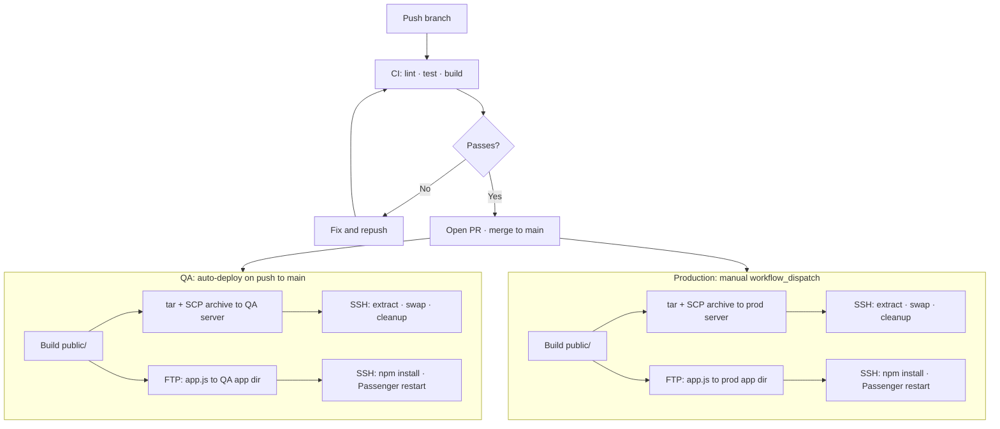

# SB Sommar – Operations Guide

How to develop, run, and deploy the site.

For a full description of the system's architecture and data flow, see [03-ARCHITECTURE.md](03-ARCHITECTURE.md).
For environment management (Local, QA, Production), secrets schema, and GitHub Environments setup, see [08-ENVIRONMENTS.md](08-ENVIRONMENTS.md).

---

## System Overview

| Layer  | Location                   | Role                                                   |
| ------ | -------------------------- | ------------------------------------------------------ |
| Data   | `source/data/*.yaml`       | Single source of truth for all events                  |
| Build  | `source/build/build.js`    | Generates HTML from data and Markdown                  |
| Server | `app.js`                   | Serves `public/` and handles the add-event API         |
| Output | `public/`                  | Generated HTML + static CSS/JS — do not edit directly  |

The server (`app.js`) does two things:

1. Serves the built static files from `public/`.
2. Handles `POST /add-event`, which commits the new event to GitHub via the Contents API, opens a PR, and enables auto-merge. The PR triggers CI (build only) and merges automatically — no admin step needed.

---

## Local Development

### Prerequisites

- Node.js 18 or later
- npm

### First-time setup

```bash
npm install
npm run build
npm start
```

The site is available at <http://localhost:3000>.

The port can be overridden:

```bash
PORT=8080 npm start
```

### Rebuilding manually

If you edit a YAML data file directly (e.g. to correct an event), rebuild:

```bash
npm run build
```

The server does not need to be restarted after a rebuild — it reads files fresh on each request.

### Commands

```bash
npm test                         # Run tests
npm run lint                     # Lint JavaScript
npm run lint:md                  # Lint Markdown
npm run test:update-snapshots    # Regenerate schedule page snapshots
```

---

## Data Files

Event data lives in `source/data/`. One YAML file per camp.

Which camp is active is derived automatically from dates at build time:

1. If today falls within a camp's `start_date..end_date`, that camp is active.
2. Otherwise, the next upcoming camp (nearest future `start_date`) is active.
3. If no upcoming camps exist, the most recent camp (latest `end_date`) is active.

Events are sorted chronologically at build time, so their order in the YAML file does not matter. New events submitted through the form are committed to GitHub and merged via auto-merge PR — the file on disk updates when the next deploy runs.

Locations are defined centrally in `source/data/local.yaml`.
Never define locations inside individual camp files.

---

## Production Deployment

### Infrastructure

The site is split into two parts deployed to the same host:

| Part                    | Deployment method | Location on host                     |
| ----------------------- | ----------------- | ------------------------------------ |
| Static site (`public/`) | SCP + SSH swap    | Web root (`DEPLOY_DIR/public_html`)  |
| API server (`app.js`)   | FTP + SSH         | App directory (`FTP_APP_DIR`)        |

The API server runs as a persistent Node.js process via Passenger.
Passenger restarts automatically when new files are uploaded.

### CI/CD Workflows

CI (Continuous Integration) runs automated checks on every push and pull request.
CD (Continuous Deployment) deploys to QA automatically after a merge to `main`;
Production deploys are triggered manually. See [08-ENVIRONMENTS.md](08-ENVIRONMENTS.md) for the full environment model.

| Workflow                  | Trigger                                                        | What it does                                                                                                                                                                                                |
| ------------------------- | -------------------------------------------------------------- | ----------------------------------------------------------------------------------------------------------------------------------------------------------------------------------------------------------- |
| `ci.yml`                  | Every push and PR                                              | Lint + test + build. Lint/test skipped for data-only commits (per-camp event files only; config files like `camps.yaml` and `local.yaml` trigger full CI). Uses `fetch-depth: 0` to compare against `main`. |
| `event-data-deploy.yml`   | PRs from `event/`, `event-edit/` changing `source/data/*.yaml` | Lint YAML + security scan + build + targeted FTP deploy to both QA and Production. Uses `fetch-depth: 0` to detect changed files.                                                                           |
| `deploy-qa.yml`           | Push to `main` (paths-ignore data YAMLs)                       | Calls `deploy-reusable.yml` with environment `qa`. Build → SCP → SSH swap → FTP app → SSH restart.                                                                                                          |
| `deploy-prod.yml`         | Manual (`workflow_dispatch`)                                    | Calls `deploy-reusable.yml` with environment `production`. Same steps as QA.                                                                                                                               |
| `deploy-reusable.yml`     | Called by `deploy-qa.yml` / `deploy-prod.yml`                   | Shared logic: Build → SCP archive → SSH swap into web root → FTP + SSH app server restart.                                                                                                                 |



### Environment Variables

| Variable         | Default | Description                                              |
| ---------------- | ------- | -------------------------------------------------------- |
| `PORT`           | `3000`  | Port the HTTP server listens on                          |
| `API_URL`        | —       | Baked into the static form HTML as the fetch target      |
| `ALLOWED_ORIGIN` | —       | Primary origin allowed by the CORS middleware            |
| `QA_ORIGIN`      | —       | Secondary origin allowed by CORS (staging/QA)            |
| `COOKIE_DOMAIN`  | —       | Shared parent domain for session cookie (see note below) |
| `GITHUB_OWNER`   | —       | GitHub repository owner                                  |
| `GITHUB_REPO`    | —       | GitHub repository name                                   |
| `GITHUB_BRANCH`  | —       | Branch to commit events to (typically `main`)            |
| `GITHUB_TOKEN`   | —       | Personal access token with repo write access             |

`API_URL`, `ALLOWED_ORIGIN`, `COOKIE_DOMAIN`, `GITHUB_*`, and FTP/SSH credentials are stored as GitHub Actions secrets and server environment variables. They are not needed for local development. Without `API_URL` set, the built form will have no submit endpoint — this is expected in local builds. Without `GITHUB_*` set, event submission via the API will fail; all other functionality works normally.

**`COOKIE_DOMAIN`**: required when the API and the static site are deployed on different subdomains (e.g. `api.sommar.example.com` and `sommar.example.com`). Set it to the shared parent domain — e.g. `sommar.digitalasynctransparency.com`. This causes the session cookie to include `Domain=<value>` so that client-side JavaScript on the static site can read it. Omit the variable for single-origin deployments.

### Manual Production Startup (first time or after server wipe)

```bash
npm install --omit=dev
npm run build
npm start
```

---

## Camp Lifecycle

### Before Camp

1. Create a new YAML file in `source/data/` (e.g. `2026-06-syssleback.yaml`).
2. Add the camp entry in `source/data/camps.yaml` with dates and `archived: false`.
3. Run `npm run build` to verify the correct camp is derived as active.
4. Deploy.

Minimal camp file:

```yaml
camp:
  id: 2026-06-syssleback
  name: SB Sommar Juni 2026
  location: Sysslebäck
  start_date: '2026-06-28'
  end_date: '2026-07-05'
events: []
```

### During Camp

Participants add events through the web form at `/lagg-till.html`.
The API server commits the event to GitHub, which triggers an auto-merge PR
and a full rebuild and deploy — typically live within a few minutes.

An admin can also edit the YAML file directly on GitHub and push to `main`
to fix or remove entries.

### After Camp

1. Set `archived: true` for the camp in `source/data/camps.yaml`.
2. Commit. The YAML file already has its permanent name — it becomes the archive as-is.
3. Deploy. The system automatically derives the next active camp from dates.

---

## Disaster Recovery

### Incorrect or unwanted event

1. Edit the current camp's YAML directly on GitHub (or locally and push).
2. Merge to `main` — the deploy pipeline rebuilds automatically.

Git history provides a full audit trail of all changes, including every event submitted through the form.

### Schedule not updating after form submission

1. Check the GitHub repository for a recently opened or stuck PR from the API.
2. If the PR is open and CI has passed, manually merge it.
3. If CI failed, inspect the build log in the Actions tab of the GitHub repository and fix accordingly.

### Site not building after a data change

1. Run `npm run build` locally and read the error output.
2. Validate the YAML file structure against [05-DATA_CONTRACT.md](05-DATA_CONTRACT.md).
3. Common causes: missing required field, date outside camp range, duplicate event ID.

### Server not responding

1. Check Passenger logs on the host.
2. Verify `app.js` and `node_modules/` are present in the app directory.
3. Re-run the manual startup steps if needed.
